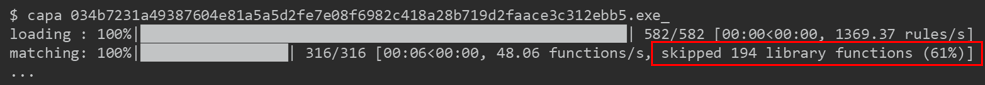
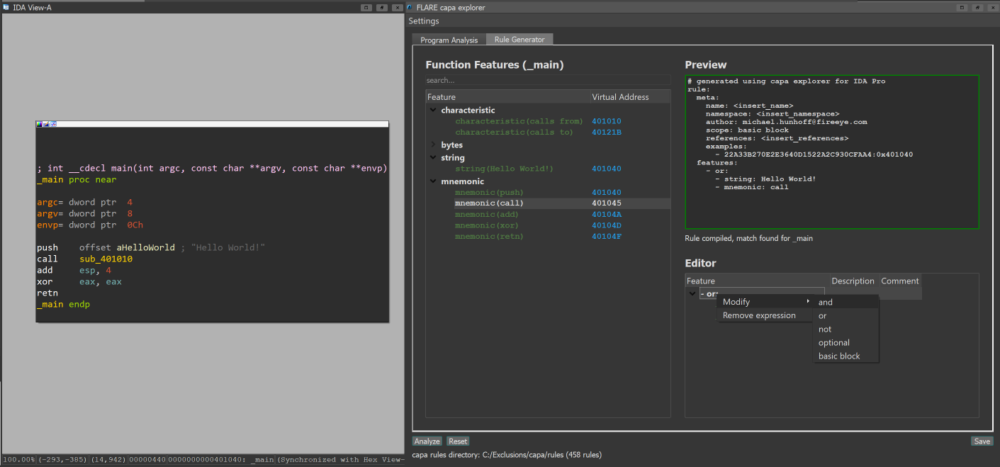

# Change Log

## master (unreleased)

### New Features
- verify rule metadata format on load #1160 @mr-tz
- dotnet: emit property features #1168 @anushkavirgaonkar
- dotnet: emit API features for objects created via the newobj instruction #1186 @mike-hunhoff
- dotnet: emit API features for generic methods #1231 @mike-hunhoff
- Python 3.11 support #1192 @williballenthin
- dotnet: emit calls to/from MethodDef methods #1236 @mike-hunhoff
- dotnet: emit namespace/class features for ldvirtftn/ldftn instructions #1241 @mike-hunhoff
- dotnet: emit namespace/class features for type references #1242 @mike-hunhoff

### Breaking Changes

### New Rules (36)

- collection/use-dotnet-library-sharpclipboard @johnk3r
- data-manipulation/encryption/aes/use-dotnet-library-encryptdecryptutils @johnk3r
- data-manipulation/json/use-dotnet-library-newtonsoftjson @johnk3r
- data-manipulation/svg/use-dotnet-library-sharpvectors @johnk3r
- executable/resource/embed-dependencies-as-resources-using-fodycostura @johnk3r @mr-tz
- communication/ftp/send/send-file-using-ftp michael.hunhof@mandiant.com anushka.virgaonkar@mandiant.com
- nursery/extract-zip-archive anushka.virgaonkar@mandiant.com
- nursery/allocate-unmanaged-memory-in-dotnet michael.hunhoff@mandiant.com
- nursery/check-file-extension-in-dotnet michael.hunhoff@mandiant.com
- nursery/decode-data-using-base64-in-dotnet michael.hunhoff@mandiant.com
- nursery/deserialize-json-in-dotnet michael.hunhoff@mandiant.com
- nursery/find-data-using-regex-in-dotnet michael.hunhoff@mandiant.com
- nursery/generate-random-filename-in-dotnet michael.hunhoff@mandiant.com
- nursery/get-os-version-in-dotnet michael.hunhoff@mandiant.com
- nursery/load-xml-in-dotnet michael.hunhoff@mandiant.com
- nursery/manipulate-unmanaged-memory-in-dotnet michael.hunhoff@mandiant.com
- nursery/save-image-in-dotnet michael.hunhoff@mandiant.com
- nursery/send-email-in-dotnet michael.hunhoff@mandiant.com
- nursery/serialize-json-in-dotnet michael.hunhoff@mandiant.com
- nursery/set-http-user-agent-in-dotnet michael.hunhoff@mandiant.com
- nursery/compile-csharp-in-dotnet michael.hunhoff@mandiant.com
- nursery/compile-visual-basic-in-dotnet michael.hunhoff@mandiant.com
- nursery/compress-data-using-gzip-in-dotnet michael.hunhoff@mandiant.com
- nursery/execute-sqlite-statement-in-dotnet michael.hunhoff@mandiant.com
- nursery/execute-via-asynchronous-task-in-dotnet michael.hunhoff@mandiant.com
- nursery/execute-via-timer-in-dotnet michael.hunhoff@mandiant.com
- nursery/execute-wmi-query-in-dotnet michael.hunhoff@mandiant.com
- nursery/manipulate-network-credentials-in-dotnet michael.hunhoff@mandiant.com
- nursery/encrypt-data-using-aes william.ballenthin@mandiant.com Ivan Kwiatkowski (@JusticeRage)
- host-interaction/uac/bypass/bypass-uac-via-rpc david.cannings@pwc.com david@edeca.net
- nursery/check-for-vm-using-instruction-vpcext richard.weiss@mandiant.com
- nursery/get-windows-directory-from-kuser_shared_data david.cannings@pwc.com
- nursery/encrypt-data-using-openssl-dsa Ana06
- nursery/encrypt-data-using-openssl-ecdsa Ana06
- nursery/encrypt-data-using-openssl-rsa Ana06
-

### Bug Fixes
- render: convert feature attributes to aliased dictionary for vverbose #1152 @mike-hunhoff
- decouple Token dependency / extractor and features #1139 @mr-tz
- update pydantic model to guarantee type coercion #1176 @mike-hunhoff
- do not overwrite version in version.py during PyInstaller build #1169 @mr-tz
- render: fix vverbose rendering of offsets #1215 @williballenthin
- elf: better detect OS via GLIBC ABI version needed and dependencies #1221 @williballenthin
- dotnet: address unhandled exceptions with improved type checking #1230 @mike-hunhoff
- fix import-to-ida script formatting #1208 @williballenthin

### capa explorer IDA Pro plugin
- fix: display instruction items #1154 @mr-tz
- fix: accept only plaintext pasted content #1194 @williballenthin
- fix: UnboundLocalError #1217 @williballenthin
- extractor: add support for COFF files and extern functions #1223 @mike-hunhoff
- fix: assume 32-bit displacement for offsets #1250 @mike-hunhoff

### Development

### Raw diffs
- [capa v4.0.1...master](https://github.com/mandiant/capa/compare/v4.0.1...master)
- [capa-rules v4.0.1...master](https://github.com/mandiant/capa-rules/compare/v4.0.1...master)


## v4.0.1 (2022-08-15)
Some rules contained invalid metadata fields that caused an error when rendering rule hits. We've updated all rules and enhanced the rule linter to catch such issues.

### New Rules (1)

- anti-analysis/obfuscation/obfuscated-with-vs-obfuscation jakub.jozwiak@mandiant.com


### Bug Fixes
- linter: use pydantic to validate rule metadata #1141 @mike-hunhoff
- build binaries using PyInstaller no longer overwrites functions in version.py #1136 @mr-tz

### Raw diffs
- [capa v4.0.0...v4.0.1](https://github.com/mandiant/capa/compare/v4.0.0...v4.0.1)
- [capa-rules v4.0.0...v4.0.1](https://github.com/mandiant/capa-rules/compare/v4.0.0...v4.0.1)

## v4.0.0 (2022-08-10)
Version 4 adds support for analyzing .NET executables. capa will autodetect .NET modules, or you can explicitly invoke the new feature extractor via `--format dotnet`. We've also extended the rule syntax for .NET features including `namespace` and `class`.

Additionally, new `instruction` scope and `operand` features enable users to create more explicit rules. These features are not backwards compatible. We removed the previously used `/x32` and `/x64` flavors of number and operand features.

We updated 49 existing rules and added 22 new rules leveraging these new features and characteristics to detect capabilities seen in .NET malware.

More breaking changes include updates to the JSON results document, freeze file format schema (now format version v2), and the internal handling of addresses.

Thanks for all the support, especially to @htnhan, @jtothej, @sara-rn, @anushkavirgaonkar, and @_re_fox!

*Deprecation warning: v4.0 will be the last capa version to support the SMDA backend.*

### New Features

 - add new scope "instruction" for matching mnemonics and operands #767 @williballenthin
 - add new feature "operand[{0, 1, 2}].number" for matching instruction operand immediate values #767 @williballenthin
 - add new feature "operand[{0, 1, 2}].offset" for matching instruction operand offsets #767 @williballenthin
 - extract additional offset/number features in certain circumstances #320 @williballenthin
 - add detection and basic feature extraction for dotnet #987 @mr-tz, @mike-hunhoff, @williballenthin
 - add file string extraction for dotnet files #1012 @mike-hunhoff
 - add file function-name extraction for dotnet files #1015 @mike-hunhoff
 - add unmanaged call characteristic for dotnet files #1023 @mike-hunhoff
 - add mixed mode characteristic feature extraction for dotnet files #1024 @mike-hunhoff
 - emit class and namespace features for dotnet files #1030 @mike-hunhoff
 - render: support Addresses that aren't simple integers, like .NET token+offset #981 @williballenthin
 - document rule tags and branches #1006 @williballenthin, @mr-tz

### Breaking Changes

  - instruction scope and operand feature are new and are not backwards compatible with older versions of capa
  - Python 3.7 is now the minimum supported Python version #866 @williballenthin
  - remove /x32 and /x64 flavors of number and operand features #932 @williballenthin
  - the tool now accepts multiple paths to rules, and JSON doc updated accordingly @williballenthin
  - extractors must use handles to identify functions/basic blocks/instructions #981 @williballenthin
  - the freeze file format schema was updated, including format version bump to v2 #986 @williballenthin

Deprecation notice: as described in [#937](https://github.com/mandiant/capa/issues/937), we plan to remove the SMDA backend for v5. If you rely on this backend, please reach out so we can discuss extending the support for SMDA or transitioning your workflow to use vivisect.

### New Rules (30)

- data-manipulation/encryption/aes/manually-build-aes-constants huynh.t.nhan@gmail.com
- nursery/get-process-image-filename michael.hunhoff@mandiant.com
- compiler/v/compiled-with-v jakub.jozwiak@mandiant.com
- compiler/zig/compiled-with-zig jakub.jozwiak@mandiant.com
- anti-analysis/packer/huan/packed-with-huan jakub.jozwiak@mandiant.com
- internal/limitation/file/internal-dotnet-file-limitation william.ballenthin@mandiant.com
- nursery/get-os-information-via-kuser_shared_data @mr-tz
- load-code/pe/resolve-function-by-parsing-PE-exports @sara-rn
- anti-analysis/packer/huan/packed-with-huan jakub.jozwiak@mandiant.com
- nursery/execute-dotnet-assembly anushka.virgaonkar@mandiant.com
- nursery/invoke-dotnet-assembly-method anushka.virgaonkar@mandiant.com
- collection/screenshot/capture-screenshot-via-keybd-event @_re_fox
- collection/browser/gather-chrome-based-browser-login-information @_re_fox
- nursery/power-down-monitor michael.hunhoff@mandiant.com
- nursery/hash-data-using-aphash @_re_fox
- nursery/hash-data-using-jshash @_re_fox
- host-interaction/file-system/files/list/enumerate-files-on-windows moritz.raabe@mandiant.com anushka.virgaonkar@mandiant.com
- nursery/check-clipboard-data anushka.virgaonkar@mandiant.com
- nursery/clear-clipboard-data anushka.virgaonkar@mandiant.com
- nursery/compile-dotnet-assembly anushka.virgaonkar@mandiant.com
- nursery/create-process-via-wmi anushka.virgaonkar@mandiant.com
- nursery/display-service-notification-message-box anushka.virgaonkar@mandiant.com
- nursery/find-process-by-name anushka.virgaonkar@mandiant.com
- nursery/generate-random-numbers-in-dotnet anushka.virgaonkar@mandiant.com
- nursery/send-keystrokes anushka.virgaonkar@mandiant.com
- nursery/send-request-in-dotnet anushka.virgaonakr@mandiant.com
- nursery/terminate-process-by-name-in-dotnet anushka.virgaonkar@mandiant.com
- nursery/hash-data-using-rshash @_re_fox
- persistence/authentication-process/act-as-credential-manager-dll jakub.jozwiak@mandiant.com
- persistence/authentication-process/act-as-password-filter-dll jakub.jozwiak@mandiant.com

### Bug Fixes
- improve handling _ prefix compile/link artifact #924 @mike-hunhoff
- better detect OS in ELF samples #988 @williballenthin
- display number feature zero in vverbose #1097 @mike-hunhoff

### capa explorer IDA Pro plugin
- improve file format extraction #918 @mike-hunhoff
- remove decorators added by IDA to ELF imports #919 @mike-hunhoff
- bug fixes for Address abstraction #1091 @mike-hunhoff

### Development

### Raw diffs
- [capa v3.2.0...v4.0.0](https://github.com/mandiant/capa/compare/v3.2.0...master)
- [capa-rules v3.2.0...v4.0.0](https://github.com/mandiant/capa-rules/compare/v3.2.0...master)

## v3.2.1 (2022-06-06)
This out-of-band release bumps the SMDA dependency version to enable installation on Python 3.10.

### Bug Fixes

- update SMDA dependency @mike-hunhoff #922

### Raw diffs
- [capa v3.2.0...v3.2.1](https://github.com/mandiant/capa/compare/v3.2.0...v3.2.1)
- [capa-rules v3.2.0...v3.2.1](https://github.com/mandiant/capa-rules/compare/v3.2.0...v3.2.1)

## v3.2.0 (2022-03-03)
This release adds a new characteristic `characteristic: call $+5` enabling users to create more explicit rules. The linter now also validates ATT&CK and MBC categories. Additionally, many dependencies, including the vivisect backend, have been updated.

One rule has been added and many more have been improved.

Thanks for all the support, especially to @kn0wl3dge and first time contributor @uckelman-sf!

### New Features

- linter: validate ATT&CK/MBC categories and IDs #103 @kn0wl3dge
- extractor: add characteristic "call $+5" feature #366 @kn0wl3dge

### New Rules (1)

- anti-analysis/obfuscation/obfuscated-with-advobfuscator jakub.jozwiak@mandiant.com

### Bug Fixes

- remove typing package as a requirement for Python 3.7+ compatibility #901 @uckelman-sf
- elf: fix OS detection for Linux kernel modules #867 @williballenthin

### Raw diffs
- [capa v3.1.0...v3.2.0](https://github.com/mandiant/capa/compare/v3.1.0...v3.2.0)
- [capa-rules v3.1.0...v3.2.0](https://github.com/mandiant/capa-rules/compare/v3.1.0...v3.2.0)

## v3.1.0 (2022-01-10)
This release improves the performance of capa while also adding 23 new rules and many code quality enhancements. We profiled capa's CPU usage and optimized the way that it matches rules, such as by short circuiting when appropriate. According to our testing, the matching phase is approximately 66% faster than v3.0.3! We also added support for Python 3.10, aarch64 builds, and additional MAEC metadata in the rule headers.
  
This release adds 23 new rules, including nine by Jakub Jozwiak of Mandiant. @ryantxu1 and @dzbeck updated the ATT&CK and MBC mappings for many rules. Thank you!
  
And as always, welcome first time contributors!

  - @kn0wl3dge
  - @jtothej
  - @cl30
  

### New Features

- engine: short circuit logic nodes for better performance #824 @williballenthin
- engine: add optimizer the order faster nodes first #829 @williballenthin
- engine: optimize rule evaluation by skipping rules that can't match #830 @williballenthin
- support python 3.10 #816 @williballenthin
- support aarch64 #683 @williballenthin
- rules: support maec/malware-family meta #841 @mr-tz
- engine: better type annotations/exhaustiveness checking #839 @cl30

### Breaking Changes: None

### New Rules (23)

- nursery/delete-windows-backup-catalog michael.hunhoff@mandiant.com
- nursery/disable-automatic-windows-recovery-features michael.hunhoff@mandiant.com
- nursery/capture-webcam-video @johnk3r
- nursery/create-registry-key-via-stdregprov michael.hunhoff@mandiant.com
- nursery/delete-registry-key-via-stdregprov michael.hunhoff@mandiant.com
- nursery/delete-registry-value-via-stdregprov michael.hunhoff@mandiant.com
- nursery/query-or-enumerate-registry-key-via-stdregprov michael.hunhoff@mandiant.com
- nursery/query-or-enumerate-registry-value-via-stdregprov michael.hunhoff@mandiant.com
- nursery/set-registry-value-via-stdregprov michael.hunhoff@mandiant.com
- data-manipulation/compression/decompress-data-using-ucl jakub.jozwiak@mandiant.com
- linking/static/wolfcrypt/linked-against-wolfcrypt jakub.jozwiak@mandiant.com
- linking/static/wolfssl/linked-against-wolfssl jakub.jozwiak@mandiant.com
- anti-analysis/packer/pespin/packed-with-pespin jakub.jozwiak@mandiant.com
- load-code/shellcode/execute-shellcode-via-windows-fibers jakub.jozwiak@mandiant.com
- load-code/shellcode/execute-shellcode-via-enumuilanguages jakub.jozwiak@mandiant.com
- anti-analysis/packer/themida/packed-with-themida william.ballenthin@mandiant.com
- load-code/shellcode/execute-shellcode-via-createthreadpoolwait jakub.jozwiak@mandiant.com
- host-interaction/process/inject/inject-shellcode-using-a-file-mapping-object jakub.jozwiak@mandiant.com
- load-code/shellcode/execute-shellcode-via-copyfile2 jakub.jozwiak@mandiant.com
- malware-family/plugx/match-known-plugx-module still@teamt5.org

### Rule Changes

  - update ATT&CK mappings by @ryantxu1
  - update ATT&CK and MBC mappings by @dzbeck
  - aplib detection by @cdong1012
  - golang runtime detection by @stevemk14eber

### Bug Fixes

- fix circular import error #825 @williballenthin
- fix smda negative number extraction #430 @kn0wl3dge

### capa explorer IDA Pro plugin

- pin supported versions to >= 7.4 and < 8.0 #849 @mike-hunhoff

### Development

- add profiling infrastructure #828 @williballenthin
- linter: detect shellcode extension #820 @mr-tz
- show features script: add backend flag #430 @kn0wl3dge

### Raw diffs
- [capa v3.0.3...v3.1.0](https://github.com/mandiant/capa/compare/v3.0.3...v3.1.0)
- [capa-rules v3.0.3...v3.1.0](https://github.com/mandiant/capa-rules/compare/v3.0.3...v3.1.0)


## v3.0.3 (2021-10-27)

This is primarily a rule maintenance release:
  - eight new rules, including all relevant techniques from [ATT&CK v10](https://medium.com/mitre-attack/introducing-attack-v10-7743870b37e3), and
  - two rules removed, due to the prevalence of false positives

We've also tweaked the status codes returned by capa.exe to be more specific and added a bit more metadata to the JSON output format.
 
As always, welcome first time contributors!
  - still@teamt5.org
  - zander.work@mandiant.com
                                                                                                     

### New Features

- show in which function a BB match is #130 @williballenthin
- main: exit with unique error codes when bailing #802 @williballenthin

### New Rules (8)

- nursery/resolve-function-by-fnv-1a-hash still@teamt5.org
- data-manipulation/encryption/encrypt-data-using-memfrob-from-glibc zander.work@mandiant.com
- collection/group-policy/discover-group-policy-via-gpresult william.ballenthin@mandiant.com
- host-interaction/bootloader/manipulate-safe-mode-programs william.ballenthin@mandiant.com
- nursery/enable-safe-mode-boot william.ballenthin@mandiant.com
- persistence/iis/persist-via-iis-module william.ballenthin@mandiant.com
- persistence/iis/persist-via-isapi-extension william.ballenthin@mandiant.com
- targeting/language/identify-system-language-via-api william.ballenthin@mandiant.com

## Removed rules (2)
- load-code/pe/parse-pe-exports: too many false positives in unrelated structure accesses
- anti-analysis/anti-vm/vm-detection/execute-anti-vm-instructions: too many false positives in junk code

### Bug Fixes

- update references from FireEye to Mandiant

### Raw diffs
- [capa v3.0.2...v3.0.3](https://github.com/fireeye/capa/compare/v3.0.2...v3.0.3)
- [capa-rules v3.0.2...v3.0.3](https://github.com/fireeye/capa-rules/compare/v3.0.2...v3.0.3)
  
## v3.0.2 (2021-09-28)
  
This release fixes an issue with the standalone executables built with PyInstaller when running capa against ELF files.

### Bug Fixes

- fix bug in PyInstaller config preventing ELF analysis #795 @mr-tz

### Raw diffs
- [capa v3.0.1...v3.0.2](https://github.com/fireeye/capa/compare/v3.0.1...v3.0.2)
- [capa-rules v3.0.1...v3.0.2](https://github.com/fireeye/capa-rules/compare/v3.0.1...v3.0.2)

## v3.0.1 (2021-09-27)

This version updates the version of vivisect used by capa. Users will experience fewer bugs and find improved analysis results.

Thanks to the community for highlighting issues and analysis misses. Your feedback is crucial to further improve capa.

### Bug Fixes

- fix many underlying bugs in vivisect analysis and update to version v1.0.5 #786 @williballenthin

### Raw diffs
- [capa v3.0.0...v3.0.1](https://github.com/fireeye/capa/compare/v3.0.0...v3.0.1)
- [capa-rules v3.0.0...v3.0.1](https://github.com/fireeye/capa-rules/compare/v3.0.0...v3.0.1)

## v3.0.0 (2021-09-15)

We are excited to announce version 3.0! :tada:

capa 3.0:
- adds support for ELF files targeting Linux thanks to [Intezer](https://www.intezer.com/)
- adds new features to specify OS, CPU architecture, and file format
- fixes a few bugs that may have led to false negatives (missed capabilities) in older versions
- adds 80 new rules, including 36 describing techniques for Linux

A huge thanks to everyone who submitted issues, provided feedback, and contributed code and rules.
Special acknowledgement to @Adir-Shemesh and @TcM1911 of [Intezer](https://www.intezer.com/) for contributing the code to enable ELF support.
Also, welcome first time contributors:
  - @jaredscottwilson
  - @cdong1012
  - @jlepore-fe 

### New Features

- all: add support for ELF files #700 @Adir-Shemesh @TcM1911
- rule format: add feature `format: ` for file format, like `format: pe` #723 @williballenthin
- rule format: add feature `arch: ` for architecture, like `arch: amd64` #723 @williballenthin
- rule format: add feature `os: ` for operating system, like `os: windows` #723 @williballenthin
- rule format: add feature `substring: ` for verbatim strings with leading/trailing wildcards #737 @williballenthin
- scripts: add `profile-memory.py` for profiling memory usage #736 @williballenthin
- main: add light weight ELF file feature extractor to detect file limitations #770 @mr-tz

### Breaking Changes

- rules using `format`, `arch`, `os`, or `substring` features cannot be used by capa versions prior to v3
- legacy term `arch` (i.e., "x32") is now called `bitness` @williballenthin
- freeze format gains new section for "global" features #759 @williballenthin

### New Rules (80)

- collection/webcam/capture-webcam-image @johnk3r
- nursery/list-drag-and-drop-files michael.hunhoff@mandiant.com
- nursery/monitor-clipboard-content michael.hunhoff@mandiant.com
- nursery/monitor-local-ipv4-address-changes michael.hunhoff@mandiant.com
- nursery/load-windows-common-language-runtime michael.hunhoff@mandiant.com
- nursery/resize-volume-shadow-copy-storage michael.hunhoff@mandiant.com
- nursery/add-user-account-group michael.hunhoff@mandiant.com
- nursery/add-user-account-to-group michael.hunhoff@mandiant.com
- nursery/add-user-account michael.hunhoff@mandiant.com
- nursery/change-user-account-password michael.hunhoff@mandiant.com
- nursery/delete-user-account-from-group michael.hunhoff@mandiant.com
- nursery/delete-user-account-group michael.hunhoff@mandiant.com
- nursery/delete-user-account michael.hunhoff@mandiant.com
- nursery/list-domain-servers michael.hunhoff@mandiant.com
- nursery/list-groups-for-user-account michael.hunhoff@mandiant.com
- nursery/list-user-account-groups michael.hunhoff@mandiant.com
- nursery/list-user-accounts-for-group michael.hunhoff@mandiant.com
- nursery/list-user-accounts michael.hunhoff@mandiant.com
- nursery/parse-url michael.hunhoff@mandiant.com
- nursery/register-raw-input-devices michael.hunhoff@mandiant.com
- anti-analysis/packer/gopacker/packed-with-gopacker jared.wilson@mandiant.com
- host-interaction/driver/create-device-object @mr-tz
- host-interaction/process/create/execute-command @mr-tz
- data-manipulation/encryption/create-new-key-via-cryptacquirecontext chuong.dong@mandiant.com
- host-interaction/log/clfs/append-data-to-clfs-log-container blaine.stancill@mandiant.com
- host-interaction/log/clfs/read-data-from-clfs-log-container blaine.stancill@mandiant.com
- data-manipulation/encryption/hc-128/encrypt-data-using-hc-128-via-wolfssl blaine.stancill@mandiant.com
- c2/shell/create-unix-reverse-shell joakim@intezer.com
- c2/shell/execute-shell-command-received-from-socket joakim@intezer.com
- collection/get-current-user joakim@intezer.com
- host-interaction/file-system/change-file-permission joakim@intezer.com
- host-interaction/hardware/memory/get-memory-information joakim@intezer.com
- host-interaction/mutex/lock-file joakim@intezer.com
- host-interaction/os/version/get-kernel-version joakim@intezer.com
- host-interaction/os/version/get-linux-distribution joakim@intezer.com
- host-interaction/process/terminate/terminate-process-via-kill joakim@intezer.com
- lib/duplicate-stdin-and-stdout joakim@intezer.com
- nursery/capture-network-configuration-via-ifconfig joakim@intezeer.com
- nursery/collect-ssh-keys joakim@intezer.com
- nursery/enumerate-processes-via-procfs joakim@intezer.com
- nursery/interact-with-iptables joakim@intezer.com
- persistence/persist-via-desktop-autostart joakim@intezer.com
- persistence/persist-via-shell-profile-or-rc-file joakim@intezer.com
- persistence/service/persist-via-rc-script joakim@intezer.com
- collection/get-current-user-on-linux joakim@intezer.com
- collection/network/get-mac-address-on-windows moritz.raabe@mandiant.com
- host-interaction/file-system/read/read-file-on-linux moritz.raabe@mandiant.com joakim@intezer.com
- host-interaction/file-system/read/read-file-on-windows moritz.raabe@mandiant.com
- host-interaction/file-system/write/write-file-on-windows william.ballenthin@mandiant.com
- host-interaction/os/info/get-system-information-on-windows moritz.raabe@mandiant.com joakim@intezer.com
- host-interaction/process/create/create-process-on-windows moritz.raabe@mandiant.com
- linking/runtime-linking/link-function-at-runtime-on-windows moritz.raabe@mandiant.com
- nursery/create-process-on-linux joakim@intezer.com
- nursery/enumerate-files-on-linux william.ballenthin@mandiant.com
- nursery/get-mac-address-on-linux joakim@intezer.com
- nursery/get-system-information-on-linux joakim@intezer.com
- nursery/link-function-at-runtime-on-linux joakim@intezer.com
- nursery/write-file-on-linux joakim@intezer.com
- communication/socket/tcp/send/obtain-transmitpackets-callback-function-via-wsaioctl jonathan.lepore@mandiant.com
- nursery/linked-against-cpp-http-library @mr-tz
- nursery/linked-against-cpp-json-library @mr-tz

### Bug Fixes

- main: fix `KeyError: 0` when reporting results @williballehtin #703
- main: fix potential false negatives due to namespaces across scopes @williballenthin #721
- linter: suppress some warnings about imports from ntdll/ntoskrnl @williballenthin #743
- linter: suppress some warnings about missing examples in the nursery @williballenthin #747

### capa explorer IDA Pro plugin

- explorer: add additional filter logic when displaying matches by function #686 @mike-hunhoff
- explorer: remove duplicate check when saving file #687 @mike-hunhoff
- explorer: update IDA extractor to use non-canon mnemonics #688 @mike-hunhoff
- explorer: allow user to add specified number of bytes when adding a Bytes feature in the Rule Generator #689 @mike-hunhoff
- explorer: enforce max column width Features and Editor panes #691 @mike-hunhoff
- explorer: add option to limit features to currently selected disassembly address #692 @mike-hunhoff
- explorer: update support documentation and runtime checks #741 @mike-hunhoff
- explorer: small performance boost to rule generator search functionality #742 @mike-hunhoff
- explorer: add support for arch, os, and format features #758 @mike-hunhoff
- explorer: improve parsing algorithm for rule generator feature editor #768 @mike-hunhoff

### Development

### Raw diffs
- [capa v2.0.0...v3.0.0](https://github.com/mandiant/capa/compare/v2.0.0...v3.0.0)
- [capa-rules v2.0.0...v3.0.0](https://github.com/mandiant/capa-rules/compare/v2.0.0...v3.0.0)


## v2.0.0 (2021-07-19)

We are excited to announce version 2.0! :tada:
capa 2.0:
- enables anyone to contribute rules more easily
- is the first Python 3 ONLY version
- provides more concise and relevant result via identification of library functions using FLIRT
  
- includes many features and enhancements for the capa explorer IDA plugin
- adds 93 new rules, including all new techniques introduced in MITRE ATT&CK v9

A huge thanks to everyone who submitted issues, provided feedback, and contributed code and rules. Many colleagues across dozens of organizations have volunteered their experience to improve this tool! :heart:


### New Features

- rules: update ATT&CK and MBC mappings https://github.com/mandiant/capa-rules/pull/317 @williballenthin
- main: use FLIRT signatures to identify and ignore library code #446 @williballenthin
- tests: update test cases and caching #545 @mr-tz
- scripts: capa2yara.py convert capa rules to YARA rules #561 @ruppde
- rule: add file-scope feature (`function-name`) for recognized library functions #567 @williballenthin
- main: auto detect shellcode based on file extension #516 @mr-tz
- main: more detailed progress bar output when matching functions #562 @mr-tz
- main: detect file limitations without doing code analysis for better performance #583 @williballenthin
- show-features: don't show features from library functions #569 @williballenthin
- linter: summarize results at the end #571 @williballenthin
- linter: check for `or` with always true child statement, e.g. `optional`, colors #348 @mr-tz

### Breaking Changes

- py3: drop Python 2 support #480 @Ana06
- meta: added `library_functions` field, `feature_counts.functions` does not include library functions any more #562 @mr-tz
- json: results document now contains parsed ATT&CK and MBC fields instead of canonical representation #526 @mr-tz
- json: record all matching strings for regex #159 @williballenthin
- main: implement file limitations via rules not code #390 @williballenthin
- json: correctly render negative offsets #619 @williballenthin
- library: remove logic from `__init__.py` throughout #622 @williballenthin

### New Rules (93)

- anti-analysis/packer/amber/packed-with-amber @gormaniac
- collection/file-managers/gather-3d-ftp-information @re-fox
- collection/file-managers/gather-alftp-information @re-fox
- collection/file-managers/gather-bitkinex-information @re-fox
- collection/file-managers/gather-blazeftp-information @re-fox
- collection/file-managers/gather-bulletproof-ftp-information @re-fox
- collection/file-managers/gather-classicftp-information @re-fox
- collection/file-managers/gather-coreftp-information @re-fox
- collection/file-managers/gather-cuteftp-information @re-fox
- collection/file-managers/gather-cyberduck-information @re-fox
- collection/file-managers/gather-direct-ftp-information @re-fox
- collection/file-managers/gather-directory-opus-information @re-fox
- collection/file-managers/gather-expandrive-information @re-fox
- collection/file-managers/gather-faststone-browser-information @re-fox
- collection/file-managers/gather-fasttrack-ftp-information @re-fox
- collection/file-managers/gather-ffftp-information @re-fox
- collection/file-managers/gather-filezilla-information @re-fox
- collection/file-managers/gather-flashfxp-information @re-fox
- collection/file-managers/gather-fling-ftp-information @re-fox
- collection/file-managers/gather-freshftp-information @re-fox
- collection/file-managers/gather-frigate3-information @re-fox
- collection/file-managers/gather-ftp-commander-information @re-fox
- collection/file-managers/gather-ftp-explorer-information @re-fox
- collection/file-managers/gather-ftp-voyager-information @re-fox
- collection/file-managers/gather-ftpgetter-information @re-fox
- collection/file-managers/gather-ftpinfo-information @re-fox
- collection/file-managers/gather-ftpnow-information @re-fox
- collection/file-managers/gather-ftprush-information @re-fox
- collection/file-managers/gather-ftpshell-information @re-fox
- collection/file-managers/gather-global-downloader-information @re-fox
- collection/file-managers/gather-goftp-information @re-fox
- collection/file-managers/gather-leapftp-information @re-fox
- collection/file-managers/gather-netdrive-information @re-fox
- collection/file-managers/gather-nexusfile-information @re-fox
- collection/file-managers/gather-nova-ftp-information @re-fox
- collection/file-managers/gather-robo-ftp-information @re-fox
- collection/file-managers/gather-securefx-information @re-fox
- collection/file-managers/gather-smart-ftp-information @re-fox
- collection/file-managers/gather-softx-ftp-information @re-fox
- collection/file-managers/gather-southriver-webdrive-information @re-fox
- collection/file-managers/gather-staff-ftp-information @re-fox
- collection/file-managers/gather-total-commander-information @re-fox
- collection/file-managers/gather-turbo-ftp-information @re-fox
- collection/file-managers/gather-ultrafxp-information @re-fox
- collection/file-managers/gather-winscp-information @re-fox
- collection/file-managers/gather-winzip-information @re-fox
- collection/file-managers/gather-wise-ftp-information @re-fox
- collection/file-managers/gather-ws-ftp-information @re-fox
- collection/file-managers/gather-xftp-information @re-fox
- data-manipulation/compression/decompress-data-using-aplib @r3c0nst @mr-tz
- host-interaction/bootloader/disable-code-signing @williballenthin
- host-interaction/bootloader/manipulate-boot-configuration @williballenthin
- host-interaction/driver/disable-driver-code-integrity @williballenthin
- host-interaction/file-system/bypass-mark-of-the-web @williballenthin
- host-interaction/network/domain/get-domain-information @recvfrom
- host-interaction/session/get-logon-sessions @recvfrom
- linking/runtime-linking/resolve-function-by-fin8-fasthash @r3c0nst @mr-tz
- nursery/build-docker-image @williballenthin
- nursery/create-container @williballenthin
- nursery/encrypt-data-using-fakem-cipher @mike-hunhoff
- nursery/list-containers @williballenthin
- nursery/run-in-container @williballenthin
- persistence/registry/appinitdlls/disable-appinit_dlls-code-signature-enforcement @williballenthin
- collection/password-manager/steal-keepass-passwords-using-keefarce @Ana06
- host-interaction/network/connectivity/check-internet-connectivity-via-wininet matthew.williams@mandiant.com michael.hunhoff@mandiant.com
- nursery/create-bits-job @mr-tz
- nursery/execute-syscall-instruction @kulinacs @mr-tz
- nursery/connect-to-wmi-namespace-via-wbemlocator michael.hunhoff@mandiant.com
- anti-analysis/obfuscation/obfuscated-with-callobfuscator johnk3r
- executable/installer/inno-setup/packaged-as-an-inno-setup-installer awillia2@cisco.com
- data-manipulation/hashing/djb2/hash-data-using-djb2 awillia2@cisco.com
- data-manipulation/encoding/base64/decode-data-using-base64-via-dword-translation-table gilbert.elliot@mandiant.com
- nursery/list-tcp-connections-and-listeners michael.hunhoff@mandiant.com
- nursery/list-udp-connections-and-listeners michael.hunhoff@mandiant.com
- nursery/log-keystrokes-via-raw-input-data michael.hunhoff@mandiant.com
- nursery/register-http-server-url michael.hunhoff@mandiant.com
- internal/limitation/file/internal-autoit-file-limitation.yml william.ballenthin@mandiant.com
- internal/limitation/file/internal-dotnet-file-limitation.yml william.ballenthin@mandiant.com
- internal/limitation/file/internal-installer-file-limitation.yml william.ballenthin@mandiant.com
- internal/limitation/file/internal-packer-file-limitation.yml william.ballenthin@mandiant.com
- host-interaction/network/domain/enumerate-domain-computers-via-ldap awillia2@cisco.com
- host-interaction/network/domain/get-domain-controller-name awillia2@cisco.com
- internal/limitation/file/internal-visual-basic-file-limitation @mr-tz
- data-manipulation/hashing/md5/hash-data-with-md5 moritz.raabe@mandiant.com
- compiler/autohotkey/compiled-with-autohotkey awillia2@cisco.com
- internal/limitation/file/internal-autohotkey-file-limitation @mr-tz
- host-interaction/process/dump/create-process-memory-minidump michael.hunhoff@mandiant.com
- nursery/get-storage-device-properties michael.hunhoff@mandiant.com
- nursery/execute-shell-command-via-windows-remote-management michael.hunhoff@mandiant.com
- nursery/get-token-privileges michael.hunhoff@mandiant.com
- nursery/prompt-user-for-credentials michael.hunhoff@mandiant.com
- nursery/spoof-parent-pid michael.hunhoff@mandiant.com

### Bug Fixes

- build: use Python 3.8 for PyInstaller to support consistently running across multiple operating systems including Windows 7 #505 @mr-tz
- main: correctly match BB-scope matches at file scope #605 @williballenthin
- main: do not process non-PE files even when --format explicitly provided #664 @mr-tz

### capa explorer IDA Pro plugin
- explorer: IDA 7.6 support #497 @williballenthin
- explorer: explain how to install IDA 7.6 patch to enable the plugin #528 @williballenthin
- explorer: document IDA 7.6sp1 as alternative to the patch #536 @Ana06
- explorer: add support for function-name feature #618 @mike-hunhoff
- explorer: circular import workaround #654 @mike-hunhoff
- explorer: add argument to control whether to automatically analyze when running capa explorer #548 @Ana06
- explorer: extract API features via function names recognized by IDA/FLIRT #661 @mr-tz

### Development

- ci: add capa release link to capa-rules tag #517 @Ana06
- ci, changelog: update `New Rules` section in CHANGELOG automatically https://github.com/mandiant/capa-rules/pull/374 #549 #604 @Ana06
- ci, changelog: support multiple author in sync GH https://github.com/mandiant/capa-rules/pull/378 @Ana06
- ci, lint: check statements for single child statements #563 @mr-tz
- ci: reject PRs without CHANGELOG update to ensure CHANGELOG is kept up-to-date #584 @Ana06
- ci: test that scripts run #660 @mr-tz

### Raw diffs

<!-- The diff uses v1.6.1 because master doesn't include v1.6.2 and v1.6.3 -->
- [capa v1.6.1...v2.0.0](https://github.com/mandiant/capa/compare/v1.6.1...v2.0.0)
- [capa-rules v1.6.1...v2.0.0](https://github.com/mandiant/capa-rules/compare/v1.6.1...v2.0.0)


## v1.6.3 (2021-04-29)

This release adds IDA 7.6 support to capa.

### Changes

- IDA 7.6 support @williballenthin @Ana06

### Raw diffs

  - [capa v1.6.2...v1.6.3](https://github.com/mandiant/capa/compare/v1.6.2...v1.6.3)


## v1.6.2 (2021-04-13)

This release backports a fix to capa 1.6: The Windows binary was built with Python 3.9 which doesn't support Windows 7.

### Bug Fixes

- build: use Python 3.8 for PyInstaller to support consistently running across multiple operating systems including Windows 7 @mr-tz @Ana06

### Raw diffs

  - [capa v1.6.1...v1.6.2](https://github.com/mandiant/capa/compare/v1.6.1...v1.6.2)


## v1.6.1 (2021-04-07)

This release includes several bug fixes, such as a vivisect issue that prevented capa from working on Windows with Python 3. It also adds 17 new rules and a bunch of improvements in the rules and IDA rule generator. We appreciate everyone who opened issues, provided feedback, and contributed code and rules.

### Upcoming changes

**This is the very last capa release that supports Python 2.** The next release will be v2.0 and will have breaking changes, including the removal of Python 2 support.

### New features

- explorer: add support for multi-line tab and SHIFT + Tab #474 @mike-hunhoff


### New Rules (17)

- encrypt data using RC4 with custom key via WinAPI @MalwareMechanic
- encrypt data using Curve25519 @dandonov
- packaged as an IExpress self-extracting archive @recvfrom
- create registry key via offline registry library @johnk3r
- open registry key via offline registry library @johnk3r
- query registry key via offline registry library @johnk3r
- set registry key via offline registry library @johnk3r
- delete registry key via offline registry library @johnk3r
- enumerate PE sections @Ana06
- inject DLL reflectively @Ana06
- inspect section memory permissions @Ana06
- parse PE exports @Ana06
- rebuild import table @Ana06
- compare security identifiers @mike-hunhoff
- get user security identifier @mike-hunhoff
- listen for remote procedure calls @mike-hunhoff
- query remote server for available data @mike-hunhoff

### Bug Fixes

- vivisect: update to v1.0.1 which includes bug fix for #459 (capa failed in Windows with Python 3 and vivisect) #512 @williballenthin
- explorer: fix initialize rules directory #464 @mike-hunhoff
- explorer: support subscope rules #493 @mike-hunhoff
- explorer: add checks to validate matched data when searching #500 @mike-hunhoff
- features, explorer: add support for string features with special characters e.g. '\n' #468 @mike-hunhoff

### Changes

- vivisect: raises `IncompatibleVivVersion` instead of `UnicodeDecodeError` when using incompatible Python 2 `.viv` files with Python3 #479 @Ana06
- explorer: improve settings modification #465 @mike-hunhoff
- rules: improvements @mr-tz, @re-fox, @mike-hunhoff
- rules, lint: enforce string with double quotes formatting in rules #468 @mike-hunhoff
- lint: ensure LF end of line #485 #486 @mr-tz
- setup: pin dependencies #513 #504 @Ana06 @mr-tz

### Development

- ci: test on Windows, Ubuntu, macOS across Python versions #470 @mr-tz @Ana06
- ci: pin OS versions #491 @williballenthin
- ci: tag capa-rules on release #476 @Ana06
- doc: document release process #476 @Ana06
- doc: Improve README badges #477 #478 @ana06 @mr-tz
- doc: update capa explorer documentation #503 @mike-hunhoff
- doc: add PR template #495 @mr-tz
- changelog: document incompatibility of viv files #475 @Ana06
- rule loading: ignore files starting with .git #492 @mr-tz

### Raw diffs

  - [capa v1.6.0...v1.6.1](https://github.com/mandiant/capa/compare/v1.6.0...v1.6.1)
  - [capa-rules v1.6.0...v1.6.1](https://github.com/mandiant/capa-rules/compare/v1.6.0...v1.6.1)


## v1.6.0 (2021-03-09)

This release adds the capa explorer rule generator plugin for IDA Pro, vivisect support for Python 3 and 12 new rules. We appreciate everyone who opened issues, provided feedback, and contributed code and rules. Thank you also to the vivisect development team (@rakuy0, @atlas0fd00m) for the Python 3 support (`vivisect==1.0.0`) and the fixes for Python 2 (`vivisect==0.2.1`).

### Rule Generator IDA Plugin

The capa explorer IDA plugin now helps you quickly build new capa rules using features extracted directly from your IDA database. Without leaving the plugin interface you can use the features extracted by capa explorer to develop and test new rules and save your work directly to your capa rules directory. To get started select the new `Rule Generator` tab, navigate to a function in the IDA `Disassembly` view, and click `Analyze`. For more information check out the capa explorer [readme](https://github.com/mandiant/capa/blob/master/capa/ida/plugin/README.md).



### Python 2/3 vivisect workspace compatibility

This version of capa adds Python 3 support in vivisect. Note that `.viv` files (generated by vivisect) are not compatible between Python 2 and Python 3. When updating to Python 3 you need to delete all the `.viv` files for capa to work.

If you get the following error (or a similar one), you most likely need to delete `.viv` files:
```
UnicodeDecodeError: 'ascii' codec can't decode byte 0x90 in position 2: ordinal not in range(128)
```

### Upcoming changes

**This is the last capa release that supports Python 2.** The next release will be v2.0 and will have breaking changes, including the removal of Python 2 support.

If you have workflows that rely on the Python 2 version and need future maintenance, please reach out. We may be able to supply limited backports of key fixes and features.

### New features

- explorer: Add capa explorer rule generator plugin for IDA Pro. Now capa explorer helps you build new capa rules!  #426, #438, #439 @mike-hunhoff
- python: Python 3 support in vivisect #421 @Ana06
- main: Add backend option in Python 3 to select the backend to be used (either SMDA or vivisect) #421 @Ana06
- python: Python 3 support in IDA #429, #437 @mike-hunhoff
- ci: test pyinstaller CI #452 @williballenthin
- scripts: enable multiple backends in `show-features.py` #429 @mike-hunhoff
- scripts: add `scripts/vivisect-py2-vs-py3.sh`  to compare vivisect Python 2 vs 3 (can easily be modified to test run times and compare different versions) #421 @Ana06

### New Rules (12)

- patch process command line @re-fox @williballenthin (graduated from nursery)
- compiled with dmd @re-fox
- compiled with exe4j @johnk3r
- compiled from Visual Basic @williballenthin
- capture screenshot in Go @TcM1911
- compiled with Nim @mike-hunhoff
- linked against Go process enumeration library @TcM1911
- linked against Go registry library @TcM1911
- linked against Go WMI library @TcM1911
- linked against Go static asset library @TcM1911
- inspect load icon resource @mike-hunhoff
- linked against XZip @mr-tz

### Bug Fixes

- ida: check for unmapped addresses when resolving data references #436 @mike-hunhoff

### Changes

- setup: vivisect v1.0.0 is the default backend for Python3 (it was SMDA before) #421 @Ana06
- setup: bump vivisect to 0.2.1 #454 @mr-tz
- linter: adding ntoskrnl, ntdll overlap lint #428 @mike-hunhoff
- ci: use py3.9 and pyinstaller 4.2 to build standalone binaries #452 @williballenthin
- scripts: remove old migration script #450 @williballenthin

### Development

- main: factor out common cli argument handling #450 @williballenthin

### Raw diffs

  - [capa v1.5.1...v1.6.0](https://github.com/mandiant/capa/compare/v1.5.1...v1.6.0)
  - [capa-rules v1.5.1...v1.6.0](https://github.com/mandiant/capa-rules/compare/v1.5.1...v1.6.0)


## v1.5.1 (2021-02-09)

This release fixes the version number that we forgot to update for v1.5.0 (therefore, v1.5.0 was not published to pypi). It also includes 1 new rule and some rule improvements.

### New Rules (1)

- encrypt data using vest @re-fox

### Raw diffs

  - [capa v1.5.0...v1.5.1](https://github.com/mandiant/capa/compare/v1.5.1...v1.6.0)
  - [capa-rules v1.5.0...v1.5.1](https://github.com/mandiant/capa-rules/compare/v1.5.1...v1.6.0)


## v1.5.0 (2021-02-05)

This release brings support for running capa under Python 3 via [SMDA](https://github.com/danielplohmann/smda), more thorough CI testing and linting, better extraction of strings and byte features, and 50 (!) new rules. We appreciate everyone who opened issues, provided feedback, and contributed code and rules. A special shout out to the following new project contributors:

  - @johnk3r
  - @doomedraven
  - @stvemillertime
  - @itreallynick
  - @0x534a
  
@dzbeck also added [Malware Behavior Catalog](https://github.com/MBCProject/mbc-markdown) (MBC) and ATT&CK mappings for many rules.

Download a standalone binary below and checkout the readme [here on GitHub](https://github.com/mandiant/capa/). Report issues on our [issue tracker](https://github.com/mandiant/capa/issues) and contribute new rules at [capa-rules](https://github.com/mandiant/capa-rules/).


### New Features

  - py3 support via SMDA #355 @danielplohmann @jcrussell
  - scripts: example of using capa as a library #372, #380 @doomedraven
  - ci: enable dependabot #373 @mr-tz
  - ci: lint rules @mr-tz
  - ci: lint rule format #401 @mr-tz
  - freeze: add base address #391 @mr-tz
  - json: meta: add base address #412 @mr-tz

### New Rules (50)

  - 64-bit execution via heavens gate @recvfrom
  - contain anti-disasm techniques @mr-tz
  - check for microsoft office emulation @re-fox
  - check for windows sandbox via device @re-fox
  - check for windows sandbox via dns suffix @re-fox
  - check for windows sandbox via genuine state @re-fox
  - check for windows sandbox via process name @re-fox
  - check for windows sandbox via registry @re-fox
  - capture microphone audio @re-fox
  - capture public ip @re-fox
  - get domain trust relationships @johnk3r
  - check HTTP status code @mr-tz
  - compiled with perl2exe @re-fox
  - compiled with ps2exe @re-fox
  - compiled with pyarmor @stvemillertime, @itreallynick
  - validate payment card number using luhn algorithm @re-fox
  - hash data using fnv @re-fox @mr-tz
  - generate random numbers via WinAPI @mike-hunhoff @johnk3r
  - enumerate files recursively @re-fox
  - get file system object information @mike-hunhoff
  - read virtual disk @re-fox
  - register minifilter driver @mike-hunhoff
  - start minifilter driver @mike-hunhoff
  - enumerate gui resources @johnk3r
  - simulate CTRL ALT DEL @mike-hunhoff
  - hijack thread execution @0x534a
  - inject dll @0x534a
  - inject pe @0x534a
  - create or open registry key @mike-hunhoff
  - delete registry value @mike-hunhoff
  - query or enumerate registry key @mike-hunhoff
  - query or enumerate registry value @mike-hunhoff
  - resume thread @0x534a
  - suspend thread @0x534a
  - allocate memory @0x534a
  - allocate RW memory @0x534a
  - contain pusha popa sequence @mr-tz
  - create or open file @mike-hunhoff
  - open process @0x534a
  - open thread @0x534a
  - get kernel32 base address @mr-tz
  - get ntdll base address @mr-tz
  - encrypt or decrypt data via BCrypt @mike-hunhoff
  - generate random numbers using the Delphi LCG @williballenthin
  - hash data via BCrypt @mike-hunhoff
  - migrate process to active window station @williballenthin
  - patch process command line @williballenthin
  - resolve function by hash @williballenthin
  - persist via Winlogon Helper DLL registry key @0x534a
  - schedule task via command line @0x534a

### Bug Fixes

  - doc: pyinstaller build process @mr-tz
  - ida: better bytes extraction #409 @mike-hunhoff
  - viv: better unicode string extraction #364 @mike-hunhoff
  - viv: better unicode string extraction #378 @mr-tz
  - viv: more xor instructions #379 @mr-tz
  - viv: decrease logging verbosity #381 @mr-tz
  - rules: fix api description syntax #403 @mike-hunhoff
  - main: disable progress background thread #410 @mike-hunhoff
  
### Changes

  - rules: return lib rules for scopes #398 @mr-tz
  
### Raw diffs

  - [capa v1.4.1...v1.5.0](https://github.com/mandiant/capa/compare/v1.4.1...v1.5.0)
  - [capa-rules v1.4.0...v1.5.0](https://github.com/mandiant/capa-rules/compare/v1.4.0...v1.5.0)

## v1.4.1 (2020-10-23)

This release fixes an issue building capa on our CI server, which prevented us from building standalone binaries for v1.4.1.

### Bug Fixes

  - install VC dependencies for Python 2.7 during Windows build
  
### Raw diffs

  - [capa v1.4.0...v1.4.1](https://github.com/mandiant/capa/compare/v1.4.0...v1.4.1)
  - [capa-rules v1.4.0...v1.4.1](https://github.com/mandiant/capa-rules/compare/v1.4.0...v1.4.1)  

## v1.4.0 (2020-10-23)

This capa release includes changes to the rule parsing, enhanced feature extraction, various bug fixes, and improved capa scripts. Everyone should benefit from the improved functionality and performance. The community helped to add 69 new rules. We appreciate everyone who opened issues, provided feedback, and contributed code and rules. A special shout out to the following new project contributors:

  - @mwilliams31
  - @yt0ng

@dzbeck added [Malware Behavior Catalog](https://github.com/MBCProject/mbc-markdown) (MBC) and ATT&CK mappings for 86 rules.

Download a standalone binary below and checkout the readme [here on GitHub](https://github.com/mandiant/capa/). Report issues on our [issue tracker](https://github.com/mandiant/capa/issues) and contribute new rules at [capa-rules](https://github.com/mandiant/capa-rules/).

### New features

  - script that demonstrates bulk processing @williballenthin #307
  - main: render MBC table @mr-tz #332
  - ida backend: improve detection of APIs called via two or more chained thunks @mike-hunhoff #340
  - viv backend: improve detection of APIs called via two or more chained thunks @mr-tz #341
  - features: extract APIs called via jmp instruction @mr-tz #337

### New rules

  - clear the Windows event log @mike-hunhoff
  - crash the Windows event logging service @mike-hunhoff
  - packed with kkrunchy @re-fox
  - packed with nspack @re-fox
  - packed with pebundle @re-fox
  - packed with pelocknt @re-fox
  - packed with peshield @re-fox
  - packed with petite @re-fox
  - packed with rlpack @re-fox
  - packed with upack @re-fox
  - packed with y0da crypter @re-fox
  - compiled with rust @re-fox
  - compute adler32 checksum @mwilliams31
  - encrypt-data-using-hc-128 @recvfrom
  - manipulate console @williballenthin
  - references logon banner @re-fox
  - terminate process via fastfail @re-fox
  - delete volume shadow copies @mr-tz
  - authenticate HMAC @mr-tz
  - compiled from EPL @williballenthin
  - compiled with Go @williballenthin
  - create Restart Manager session @mike-hunhoff
  - decode data using Base64 via WinAPI @mike-hunhoff
  - empty recycle bin quietly @mwilliams31
  - enumerate network shares @mike-hunhoff
  - hook routines via microsoft detours @williballenthin
  - hooked by API Override @williballenthin
  - impersonate user @mike-hunhoff
  - the @williballenthin packer detection package, thanks to Hexacorn for the data, see https://www.hexacorn.com/blog/2016/12/15/pe-section-names-re-visited/
    - packed with CCG
    - packed with Crunch
    - packed with Dragon Armor
    - packed with enigma
    - packed with Epack
    - packed with MaskPE
    - packed with MEW
    - packed with Mpress
    - packed with Neolite
    - packed with PECompact
    - packed with Pepack
    - packed with Perplex
    - packed with ProCrypt
    - packed with RPCrypt
    - packed with SeauSFX
    - packed with Shrinker
    - packed with Simple Pack
    - packed with StarForce
    - packed with SVKP
    - packed with Themida
    - packed with TSULoader
    - packed with VProtect
    - packed with WWPACK
    - rebuilt by ImpRec
    - packaged as a Pintool
    - packaged as a CreateInstall installer
    - packaged as a WinZip self-extracting archive
  - reference 114DNS DNS server @williballenthin
  - reference AliDNS DNS server @williballenthin
  - reference Cloudflare DNS server @williballenthin
  - reference Comodo Secure DNS server @williballenthin
  - reference Google Public DNS server @williballenthin
  - reference Hurricane Electric DNS server @williballenthin
  - reference kornet DNS server @williballenthin
  - reference L3 DNS server @williballenthin
  - reference OpenDNS DNS server @williballenthin
  - reference Quad9 DNS server @williballenthin
  - reference Verisign DNS server @williballenthin
  - run as service @mike-hunhoff
  - schedule task via ITaskService @mike-hunhoff
  - references DNS over HTTPS endpoints @yt0ng

### Bug fixes

  - ida plugin: fix tree-view exception @mike-hunhoff #315
  - ida plugin: fix feature count @mike-hunhoff
  - main: fix reported total rule count @williballenthin #325
  - features: fix handling of API names with multiple periods @mike-hunhoff #329
  - ida backend: find all byte sequences instead of only first @mike-hunhoff #335
  - features: display 0 value @mr-tz #338
  - ida backend: extract ordinal and name imports @mr-tz #343
  - show-features: improvements and support within IDA @mr-tz #342
  - main: sanity check MBC rendering @williballenthin
  - main: handle sample path that contains non-ASCII characters @mr-tz #328

### Changes

  - rules: use yaml.CLoader for better performance @williballenthin #306
  - rules: parse descriptions for statements @mr-tz #312

### Raw diffs

  - [capa v1.3.0...v1.4.0](https://github.com/mandiant/capa/compare/v1.3.0...v1.4.0)
  - [capa-rules v1.3.0...v1.4.0](https://github.com/mandiant/capa-rules/compare/v1.3.0...v1.4.0)

## v1.3.0 (2020-09-14)

This release brings newly updated mappings to the [Malware Behavior Catalog version 2.0](https://github.com/MBCProject/mbc-markdown), many enhancements to the IDA Pro plugin, [flare-capa on PyPI](https://pypi.org/project/flare-capa/), a bunch of bug fixes to improve feature extraction, and four new rules. We received contributions from ten reverse engineers, including seven new ones:

  - @dzbeck
  - @recvfrom
  - @toomanybananas
  - @cclauss 
  - @adamprescott91 
  - @weslambert
  - @stevemk14ebr 
  
Download a standalone binary below and checkout the readme [here on GitHub](https://github.com/mandiant/capa/). Report issues on our [issue tracker](https://github.com/mandiant/capa/issues) and contribute new rules at [capa-rules](https://github.com/mandiant/capa-rules/).

### Key changes to IDA Plugin

The IDA Pro integration is now distributed as a real plugin, instead of a script. This enables a few things:

  - keyboard shortcuts and file menu integration
  - updates distributed PyPI/`pip install --upgrade` without touching your `%IDADIR%`
  - generally doing thing the "right way"

How to get this new version? Its easy: download [capa_explorer.py](https://raw.githubusercontent.com/mandiant/capa/master/capa/ida/plugin/capa_explorer.py) to your IDA plugins directory and update your capa installation (incidentally, this is a good opportunity to migrate to `pip install flare-capa` instead of git checkouts). Now you should see the plugin listed in the `Edit > Plugins > FLARE capa explorer` menu in IDA. 

Please refer to the plugin [readme](https://github.com/mandiant/capa/blob/master/capa/ida/plugin/README.md) for additional information on installing and using the IDA Pro plugin.

Please open an issue in this repository if you notice anything weird.
 
### New features

  - ida plugin: now a real plugin, not a script @mike-hunhoff 
  - core: distributed via PyPI as [flare-capa](https://pypi.org/project/flare-capa/) @williballenthin 
  - features: enable automatic A/W handling for imports @williballenthin @Ana06 #246 
  - ida plugin: persist rules directory setting via [ida-settings](https://github.com/williballenthin/ida-settings) @williballenthin #268
  - ida plugin: add search bar to results view @williballenthin #285
  - ida plugin: add `Analyze` and `Reset` buttons to tree view @mike-hunhoff #304
  - ida plugin: add status label to tree view @mike-hunhoff
  - ida plugin: add progress indicator @mike-hunhoff, @mr-tz

### New rules

  - compiled with py2exe @re-fox
  - resolve path using msvcrt @re-fox 
  - decompress data using QuickLZ @edeca
  - encrypt data using sosemanuk @recvfrom 

### Bug fixes

  - rule: reduce FP in DNS resolution @toomanybananas
  - engine: report correct strings matched via regex @williballenthin #262 
  - formatter: correctly format descriptions in two-line syntax @williballenthin @recvfrom #263 
  - viv: better extract offsets from SibOper operands @williballenthin @edeca #276 
  - import-to-ida: fix import error @cclauss 
  - viv: don't write settings to ~/.viv/viv.json @williballenthin @rakuy0 @weslambert #244
  - ida plugin: remove dependency loop that resulted in unnecessary overhead @mike-hunhoff #303
  - ida plugin: correctly highlight regex matches in IDA Disassembly view @mike-hunhoff #305
  - ida plugin: better handle rule directory prompt and failure case @stevemk14ebr @mike-hunhoff #309

### Changes

  - rules: update meta mapping to MBC 2.0! @dzbeck
  - render: don't display rules that are also matched by other rules @williballenthin @Ana06 #224
  - ida plugin: simplify tabs, removing summary and adding detail to results view @williballenthin #286
  - ida plugin: analysis is no longer automatically started when plugin is first opened @mike-hunhoff #304
  - ida plugin: user must manually select a capa rules directory before analysis can be performed @mike-hunhoff
  - ida plugin: user interface controls are disabled until analysis is performed @mike-hunhoff #304

### Raw diffs

  - [capa v1.2.0...v1.3.0](https://github.com/mandiant/capa/compare/v1.2.0...v1.3.0)
  - [capa-rules v1.2.0...v1.3.0](https://github.com/mandiant/capa-rules/compare/v1.2.0...v1.3.0)

## v1.2.0 (2020-08-31)

This release brings UI enhancements, especially for the IDA Pro plugin, 
investment towards py3 support,
fixes some bugs identified by the community, 
and 46 (!) new rules.
We received contributions from ten reverse engineers, including five new ones:

  - @agithubuserlol
  - @recvfrom
  - @D4nch3n
  - @edeca
  - @winniepe 
  
Download a standalone binary below and checkout the readme [here on GitHub](https://github.com/mandiant/capa/).
Report issues on our [issue tracker](https://github.com/mandiant/capa/issues)
and contribute new rules at [capa-rules](https://github.com/mandiant/capa-rules/).
 
### New features

  - ida plugin: display arch flavors @mike-hunhoff
  - ida plugin: display block descriptions @mike-hunhoff
  - ida backend: extract features from nested pointers @mike-hunhoff
  - main: show more progress output @williballenthin
  - core: pin dependency versions #258 @recvfrom

### New rules
  - bypass UAC via AppInfo ALPC @agithubuserlol
  - bypass UAC via token manipulation @agithubuserlol
  - check for sandbox and av modules @re-fox
  - check for sandbox username @re-fox
  - check if process is running under wine @re-fox
  - validate credit card number using luhn algorithm @re-fox
  - validate credit card number using luhn algorithm with no lookup table @re-fox
  - hash data using FNV @edeca @mr-tz
  - link many functions at runtime @mr-tz
  - reference public RSA key @mr-tz
  - packed with ASPack @williballenthin
  - delete internet cache @mike-hunhoff
  - enumerate internet cache @mike-hunhoff
  - send ICMP echo request @mike-hunhoff
  - check for debugger via API @mike-hunhoff
  - check for hardware breakpoints @mike-hunhoff
  - check for kernel debugger via shared user data structure @mike-hunhoff
  - check for protected handle exception @mike-hunhoff
  - check for software breakpoints @mike-hunhoff
  - check for trap flag exception @mike-hunhoff
  - check for unexpected memory writes @mike-hunhoff
  - check process job object @mike-hunhoff
  - reference anti-VM strings targeting Parallels @mike-hunhoff
  - reference anti-VM strings targeting Qemu @mike-hunhoff
  - reference anti-VM strings targeting VirtualBox @mike-hunhoff
  - reference anti-VM strings targeting VirtualPC @mike-hunhoff
  - reference anti-VM strings targeting VMWare @mike-hunhoff
  - reference anti-VM strings targeting Xen @mike-hunhoff
  - reference analysis tools strings @mike-hunhoff
  - reference WMI statements @mike-hunhoff
  - get number of processor cores @mike-hunhoff
  - get number of processors @mike-hunhoff
  - enumerate disk properties @mike-hunhoff
  - get disk size @mike-hunhoff
  - get process heap flags @mike-hunhoff
  - get process heap force flags @mike-hunhoff
  - get Explorer PID @mike-hunhoff
  - delay execution @mike-hunhoff
  - check for process debug object @mike-hunhoff
  - check license value @mike-hunhoff
  - check ProcessDebugFlags @mike-hunhoff
  - check ProcessDebugPort @mike-hunhoff
  - check SystemKernelDebuggerInformation @mike-hunhoff
  - check thread yield allowed @mike-hunhoff
  - enumerate system firmware tables @mike-hunhoff
  - get system firmware table @mike-hunhoff
  - hide thread from debugger @mike-hunhoff

### Bug fixes

  - ida backend: extract unmapped immediate number features @mike-hunhoff
  - ida backend: fix stack cookie check #257 @mike-hunhoff
  - viv backend: better extract gs segment access @williballenthin
  - core: enable counting of string features #241 @D4nch3n @williballenthin
  - core: enable descriptions on feature with arch flavors @mike-hunhoff
  - core: update git links for non-SSH access #259 @recvfrom

### Changes

  - ida plugin: better default display showing first level nesting @winniepe
  - remove unused `characteristic(switch)` feature @ana06
  - prepare testing infrastructure for multiple backends/py3 @williballenthin
  - ci: zip build artifacts @ana06
  - ci: build all supported python versions @ana06
  - code style and formatting @mr-tz

### Raw diffs

  - [capa v1.1.0...v1.2.0](https://github.com/mandiant/capa/compare/v1.1.0...v1.2.0)
  - [capa-rules v1.1.0...v1.2.0](https://github.com/mandiant/capa-rules/compare/v1.1.0...v1.2.0)

## v1.1.0 (2020-08-05)

This release brings new rule format updates, such as adding `offset/x32` and negative offsets,
fixes some bugs identified by the community, and 28 (!) new rules.
We received contributions from eight reverse engineers, including four new ones:

  - @re-fox
  - @psifertex
  - @bitsofbinary
  - @threathive
  
Download a standalone binary below and checkout the readme [here on GitHub](https://github.com/mandiant/capa/). Report issues on our [issue tracker](https://github.com/mandiant/capa/issues) and contribute new rules at [capa-rules](https://github.com/mandiant/capa-rules/).
  
### New features

  - import: add Binary Ninja import script #205 #207 @psifertex
  - rules: offsets can be negative #197 #208 @williballenthin
  - rules: enable descriptions for statement nodes #194 #209 @Ana06
  - rules: add arch flavors to number and offset features #210 #216 @williballenthin
  - render: show SHA1/SHA256 in default report #164 @threathive
  - tests: add tests for IDA Pro backend #202 @williballenthin
  
### New rules

  - check for unmoving mouse cursor @BitsOfBinary
  - check mutex and exit @re-fox
  - parse credit card information @re-fox
  - read ini file @re-fox
  - validate credit card number with luhn algorithm @re-fox
  - change the wallpaper @re-fox
  - acquire debug privileges @williballenthin
  - import public key @williballenthin
  - terminate process by name @williballenthin
  - encrypt data using DES @re-fox
  - encrypt data using DES via WinAPI @re-fox
  - hash data using sha1 via x86 extensions @re-fox
  - hash data using sha256 via x86 extensions @re-fox
  - capture network configuration via ipconfig @re-fox
  - hash data via WinCrypt @mike-hunhoff
  - get file attributes @mike-hunhoff
  - allocate thread local storage @mike-hunhoff
  - get thread local storage value @mike-hunhoff
  - set thread local storage @mike-hunhoff
  - get session integrity level @mike-hunhoff
  - add file to cabinet file @mike-hunhoff
  - flush cabinet file @mike-hunhoff
  - open cabinet file @mike-hunhoff
  - gather firefox profile information @re-fox
  - encrypt data using skipjack @re-fox
  - encrypt data using camellia @re-fox
  - hash data using tiger @re-fox
  - encrypt data using blowfish @re-fox
  - encrypt data using twofish @re-fox

### Bug fixes

  - linter: fix exception when examples is `None` @Ana06
  - linter: fix suggested recommendations via templating @williballenthin
  - render: fix exception when rendering counts @williballenthin
  - render: fix render of negative offsets @williballenthin
  - extractor: fix segmentation violation from vivisect @williballenthin
  - main: fix crash when .viv cannot be saved #168 @secshoggoth @williballenthin
  - main: fix shellcode .viv save path @williballenthin

### Changes

  - doc: explain how to bypass gatekeeper on macOS @psifertex
  - doc: explain supported linux distributions @Ana06
  - doc: explain submodule update with --init @psifertex
  - main: improve program help output @mr-tz
  - main: disable progress when run in quiet mode @mr-tz
  - main: assert supported IDA versions @mr-tz
  - extractor: better identify nested pointers to strings @williballenthin
  - setup: specify vivisect download url @Ana06
  - setup: pin vivisect version @williballenthin
  - setup: bump vivisect dependency version @williballenthin
  - setup: set Python project name to `flare-capa` @williballenthin
  - ci: run tests and linter via GitHub Actions @Ana06
  - hooks: run style checkers and hide stashed output @Ana06
  - linter: ignore period in rule filename @williballenthin
  - linter: warn on nursery rule with no changes needed @williballenthin

### Raw diffs

  - [capa v1.0.0...v1.1.0](https://github.com/mandiant/capa/compare/v1.0.0...v1.1.0)
  - [capa-rules v1.0.0...v1.1.0](https://github.com/mandiant/capa-rules/compare/v1.0.0...v1.1.0)
