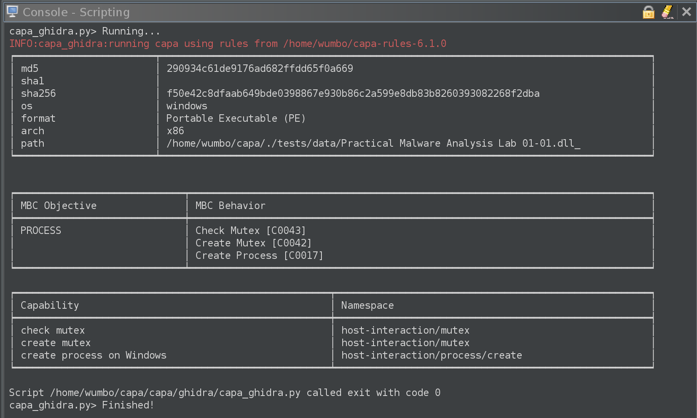
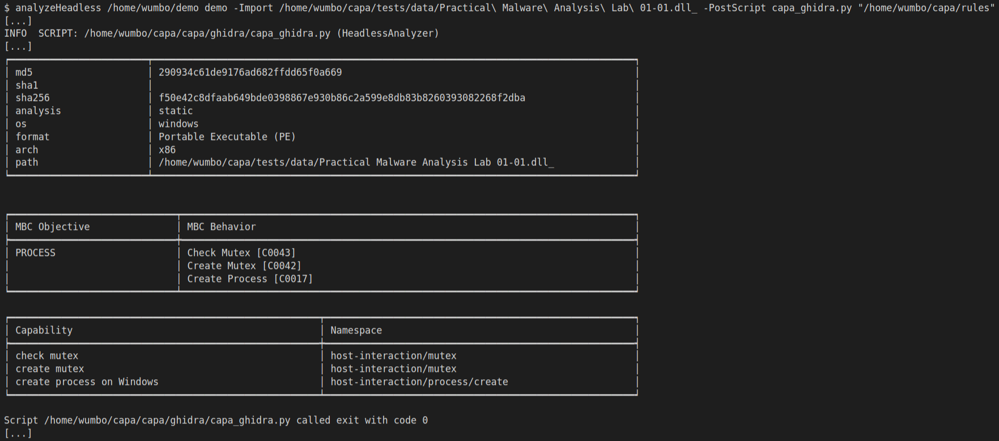

<div align="center">
    
</div>

# capa + Ghidra

[capa](https://github.com/mandiant/capa) is the FLARE team’s open-source tool that detects capabilities in executable files. [Ghidra](https://github.com/NationalSecurityAgency/ghidra) is an open-source software reverse engineering framework created and maintained by the National Security Agency Research Directorate. capa + Ghidra brings capa’s detection capabilities directly to Ghidra’s user interface helping speed up your reverse engineering tasks by identifying what parts of a program suggest interesting behavior, such as setting a registry value. You can execute the included Python 3 scripts [capa_explorer.py](https://raw.githubusercontent.com/mandiant/capa/master/capa/ghidra/capa_explorer.py) or [capa_ghidra.py](https://raw.githubusercontent.com/mandiant/capa/master/capa/ghidra/capa_ghidra.py) to run capa’s analysis and view the results in Ghidra. You may be asking yourself, “Python 3 scripts in Ghidra?”. You read that correctly. This integration is written entirely in Python 3 and relies on [Ghidrathon]( https://github.com/mandiant/ghidrathon), an open source Ghidra extension that adds Python 3 scripting to Ghidra.

Check out our capa + Ghidra blog posts:
* [Riding Dragons: capa Harnesses Ghidra](https://www.mandiant.com/resources/blog/capa-harnesses-ghidra)

## UI Integration
[capa_explorer.py](https://raw.githubusercontent.com/mandiant/capa/master/capa/ghidra/capa_explorer.py) renders capa results in Ghidra's UI to help you quickly navigate them. This includes adding matched functions to Ghidra’s Symbol Tree and Bookmarks windows and adding comments to functions that indicate matched capabilities and features. You can execute this script using Ghidra’s Script Manager window.

### Symbol Tree Window
Matched functions are added to Ghidra's Symbol Tree window under a custom namespace that maps to the capabilities' [capa namespace](https://github.com/mandiant/capa-rules/blob/master/doc/format.md#rule-namespace).
<div align="center">
    
</div>

### Comments

Comments are added at the beginning of matched functions indicating matched capabilities and inline comments are added to functions indicating matched features. You can view these comments in Ghidra’s Disassembly Listing and Decompile windows.
<div align="center">
    
</div>

### Bookmarks

Bookmarks are added to functions that matched a capability that is mapped to a MITRE ATT&CK and/or Malware Behavior Catalog (MBC) technique. You can view these bookmarks in Ghidra's Bookmarks window.
<div align="center">
    
</div>

## Text-based Integration

[capa_ghidra.py](https://raw.githubusercontent.com/mandiant/capa/master/capa/ghidra/capa_ghidra.py) outputs text-based capa results that mirror the output of capa’s standalone tool. You can execute this script using Ghidra’s Script Manager and view its output in Ghidra’s Console window.

<div align="center">
  
</div>

You can also execute [capa_ghidra.py](https://raw.githubusercontent.com/mandiant/capa/master/capa/ghidra/capa_ghidra.py) using Ghidra's Headless Analyzer to view its output in a terminal window.

<div align="center">
  
</div>

# Getting Started

## Requirements

| Tool | Version | Source |
|------------|---------|--------|
| capa | `>= 7.0.0` | https://github.com/mandiant/capa/releases |
| Ghidrathon | `>= 3.0.0` | https://github.com/mandiant/Ghidrathon/releases |
| Ghidra | `>= 10.3.2` | https://github.com/NationalSecurityAgency/ghidra/releases |
| Python | `>= 3.10.0` | https://www.python.org/downloads |

## Installation

**Note**: capa + Ghidra relies on [Ghidrathon]( https://github.com/mandiant/ghidrathon) to execute Python 3 code in Ghidra. You must first install and configure Ghidrathon using the [steps outlined in its README]( https://github.com/mandiant/ghidrathon?tab=readme-ov-file#installing-ghidrathon). Then, you must use the Python 3 interpreter that you configured with Ghidrathon to complete the following steps:

1. Install capa and its dependencies from PyPI using the following command:
```bash
$ pip install flare-capa
```

2. Download and extract the [official capa rules](https://github.com/mandiant/capa-rules/releases) that match the capa version you have installed. You can use the following command to view the version of capa you have installed:
```bash
$ pip show flare-capa
OR
$ capa --version
```

3. Copy [capa_explorer.py](https://raw.githubusercontent.com/mandiant/capa/master/capa/ghidra/capa_explorer.py) and [capa_ghidra.py](https://raw.githubusercontent.com/mandiant/capa/master/capa/ghidra/capa_ghidra.py) to your `ghidra_scripts` directory or manually add the parent directory of each script using Ghidra’s Script Manager.

## Usage

You can execute [capa_explorer.py](https://raw.githubusercontent.com/mandiant/capa/master/capa/ghidra/capa_explorer.py) and [capa_ghidra.py](https://raw.githubusercontent.com/mandiant/capa/master/capa/ghidra/capa_ghidra.py) using Ghidra’s Script Manager. [capa_ghidra.py](https://raw.githubusercontent.com/mandiant/capa/master/capa/ghidra/capa_ghidra.py) can also be executed using Ghidra's Headless Analyzer.

### Execution using Ghidra’s Script Manager

You can execute [capa_explorer.py](https://raw.githubusercontent.com/mandiant/capa/master/capa/ghidra/capa_explorer.py) and [capa_ghidra.py](https://raw.githubusercontent.com/mandiant/capa/master/capa/ghidra/capa_ghidra.py) using Ghidra's Script Manager as follows:
1. Navigate to `Window > Script Manager`
2. Expand the `Python 3 > capa` category
3. Double-click a script to execute it

Both scripts ask you to provide the path of your capa rules directory (see installation step 2). [capa_ghidra.py](https://raw.githubusercontent.com/mandiant/capa/master/capa/ghidra/capa_ghidra.py) also has you choose one of `default`, `verbose`, and `vverbose` output formats which mirror the output formats of capa’s standalone tool.

### Execution using Ghidra’s Headless Analyzer

You can execute [capa_ghidra.py](https://raw.githubusercontent.com/mandiant/capa/master/capa/ghidra/capa_ghidra.py) using Ghidra’s Headless Analyzer by invoking the `analyzeHeadless` script included with Ghidra in its `support` directory. The following arguments must be provided:

| Argument | Description |
|----|----|
|`<project_path>`| Path to Ghidra project|
| `<project_name>`| Name of Ghidra Project|
| `-Process <sample_name>` OR `-Import <sample_path>`| Name of sample `<sample_name>` already imported into `<project_name>` OR absolute path of sample `<sample_path>` to import into `<project_name>`|
| `-ScriptPath <script_path>`| OPTIONAL parent directory `<script_path>` of [capa_ghidra.py](https://raw.githubusercontent.com/mandiant/capa/master/capa/ghidra/capa_ghidra.py)|
| `-PostScript capa_ghidra.py`| Execute [capa_ghidra.py](https://raw.githubusercontent.com/mandiant/capa/master/capa/ghidra/capa_ghidra.py) after Ghidra analysis|
| `"<script_args>"`| Quoted string `"<script_args>"` containing script arguments passed to [capa_ghidra.py](https://raw.githubusercontent.com/mandiant/capa/master/capa/ghidra/capa_ghidra.py) that must specify a capa rules path and optionally the output format (`--verbose`, `--vverbose`, `--json`) – you can specify `”help”` to view the script’s help message |

The following is an example of combining these arguments into a single `analyzeHeadless` script command:
```bash
$ analyzeHeadless /home/wumbo/demo demo -Import /home/wumbo/capa/tests/data/Practical\ Malware\ Analysis\ Lab\ 01-01.dll_ -PostScript capa_ghidra.py "/home/wumbo/capa/rules --verbose"
```
