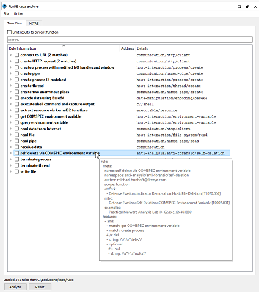
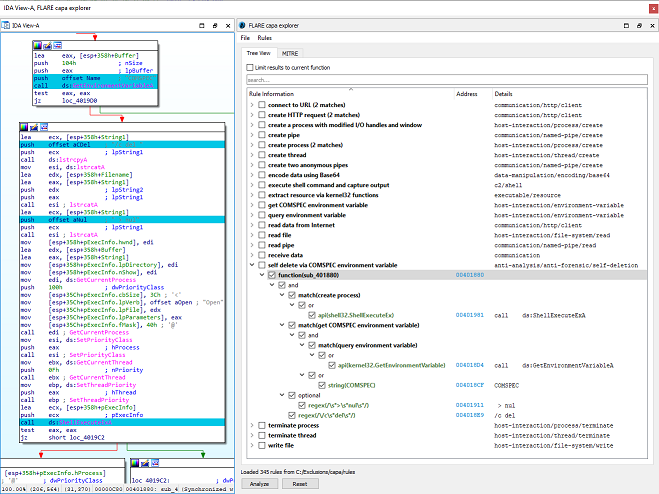
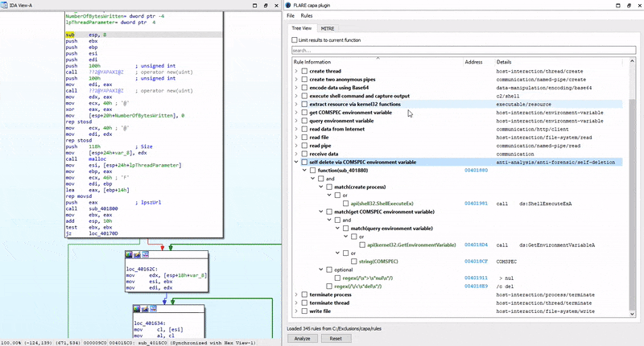

capa explorer is an IDA Pro plugin written in Python that integrates the FLARE team's open-source framework, capa, with IDA. capa is a framework that uses a well-defined collection of rules to 
identify capabilities in a program. You can run capa against a PE file or shellcode and it tells you what it thinks the program can do. For example, it might suggest that 
the program is a backdoor, can install services, or relies on HTTP to communicate. You can use capa explorer to run capa directly on an IDA database without requiring access
to the source binary. Once a database has been analyzed, capa explorer can be used to quickly identify and navigate to interesting areas of a program 
and dissect capa rule matches at the assembly level.

We love using capa explorer during malware analysis because it teaches us what parts of a program suggest a behavior. As we click on rows, capa explorer jumps directly 
to important addresses in the IDA Pro database and highlights key features in the Disassembly view so they stand out visually. To illustrate, we use capa explorer to 
analyze Lab 14-02 from [Practical Malware Analysis](https://nostarch.com/malware) (PMA) available [here](https://practicalmalwareanalysis.com/labs/). Our goal is to understand 
the program's functionality.

After loading Lab 14-02 into IDA and analyzing the database with capa explorer, we see that capa detected a rule match for `self delete via COMSPEC environment variable`:



We can use capa explorer to navigate the IDA Disassembly view directly to the suspect function and get an assembly-level breakdown of why capa matched `self delete via COMSPEC environment variable` 
for this particular function.



Using the `Rule Information` and `Details` columns capa explorer shows us that the suspect function matched `self delete via COMSPEC environment variable` because it contains capa rule matches for `create process`, `get COMSPEC environment variable`,
and `query environment variable`, references to the strings `COMSPEC`, ` > nul`, and `/c del`, and calls to the Windows API functions `GetEnvironmentVariableA` and `ShellExecuteEx`.

For more information on the FLARE team's open-source framework, capa, check out the overview in our first [blog](https://www.fireeye.com/blog/threat-research/2020/07/capa-automatically-identify-malware-capabilities.html).

## Features



* Display capa results in an interactive tree view of rule matches and their locations in the current database
* Search for keywords or phrases found in the `Rule Information`, `Address`, or `Details` columns
* Display rule source content when a user hovers their cursor over a rule match
* Double-click `Address` column to view associated feature in the IDA Disassembly view
* Limit tree view results to the function currently displayed in the IDA Disassembly view; update results as a user navigates to different functions
* Export results as formatted JSON by navigating to `File > Export results...`
* Remember a user's capa rules directory for future runs; change capa rules directory by navigating to `Rules > Change rules directory...`
* Automatically re-analyze database when user performs a program rebase
* Automatically update results when IDA is used to rename a function
* Select one or more checkboxes to highlight the associated addresses in the IDA Disassembly view
* Right-click a function match to rename it; the new function name is propagated to the current IDA database
* Right-click to copy a result by column or by row
* Sort results by column
* Reset tree view and IDA Disassembly view highlighting by clicking `Reset`

## Getting Started

### Requirements

capa explorer supports the following IDA setups:

* IDA Pro 7.4+ with Python 2.7 or Python 3.

If you encounter issues with your specific setup, please open a new [Issue](https://github.com/fireeye/capa/issues).

### Supported File Types

capa explorer is limited to the file types supported by capa, which includes:

* Windows 32-bit and 64-bit PE files
* Windows 32-bit and 64-bit shellcode

### Installation

You can install capa explorer using the following steps:

1. Install capa and its dependencies from PyPI for the Python interpreter used by your IDA installation:
    ```
    $ pip install flare-capa
    ```
3. Download the [standard collection of capa rules](https://github.com/fireeye/capa-rules) (capa explorer needs capa rules to analyze a database)
4. Copy [capa_explorer.py](https://raw.githubusercontent.com/fireeye/capa/master/capa/ida/plugin/capa_explorer.py) to your IDA plugins directory

### Usage

1. Run IDA and analyze a supported file type (select the `Manual Load` and `Load Resources` options in IDA for best results)
2. Open capa explorer in IDA by navigating to `Edit > Plugins > FLARE capa explorer` or using the keyboard shortcut `Alt+F5`
3. Click the `Analyze` button

When running capa explorer for the first time you are prompted to select a file directory containing capa rules. The plugin conveniently
remembers your selection for future runs; you can change this selection by navigating to `Rules > Change rules directory...`. We recommend 
downloading and using the [standard collection of capa rules](https://github.com/fireeye/capa-rules) when getting started with the plugin.

#### Tips

* Start analysis by clicking the `Analyze` button
* Reset the plugin user interface and remove highlighting from IDA disassembly view by clicking the `Reset` button
* Change your capa rules directory by navigating to `Rules > Change rules directory...` from the plugin menu
* Hover your cursor over a rule match to view the source content of the rule
* Double-click the `Address` column to navigate the IDA Disassembly view to the associated feature
* Double-click a result in the `Rule Information` column to expand its children
* Select a checkbox in the `Rule Information` column to highlight the address of the associated feature in the IDA Dissasembly view

## Development

Because capa explorer is packaged with capa you will need to install capa locally for development.

You can install capa locally by following the steps outlined in `Method 3: Inspecting the capa source code` of the [capa 
installation guide](https://github.com/fireeye/capa/blob/master/doc/installation.md#method-3-inspecting-the-capa-source-code). Once installed, copy [capa_explorer.py](https://raw.githubusercontent.com/fireeye/capa/master/capa/ida/plugin/capa_explorer.py) 
to your IDA plugins directory to run the plugin in IDA.

### Components

capa explorer consists of two main components:

* An IDA [feature extractor](https://github.com/fireeye/capa/tree/master/capa/features/extractors/ida) built on top of IDA's binary analysis engine
  * This component uses IDAPython to extract [capa features](https://github.com/fireeye/capa-rules/blob/master/doc/format.md#extracted-features) from the IDA database such as strings, 
disassembly, and control flow; these extracted features are used by capa to find feature combinations that result in a rule match
* An [interactive user interface](https://github.com/fireeye/capa/tree/master/capa/ida/plugin) for displaying and exploring capa rule matches
  * This component integrates the IDA feature extractor and capa, providing an interactive user interface to dissect rule matches found by capa using features extracted by the IDA feature extractor
