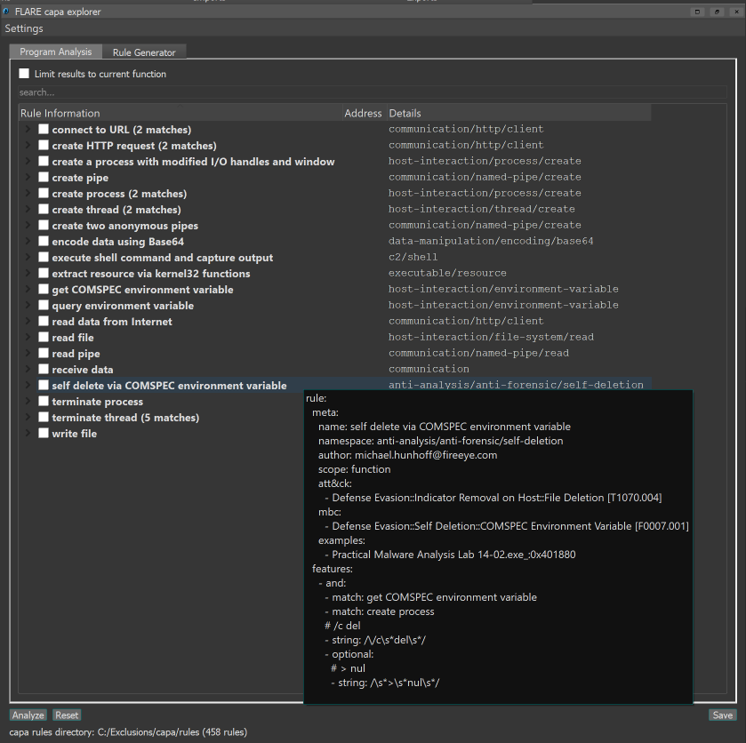
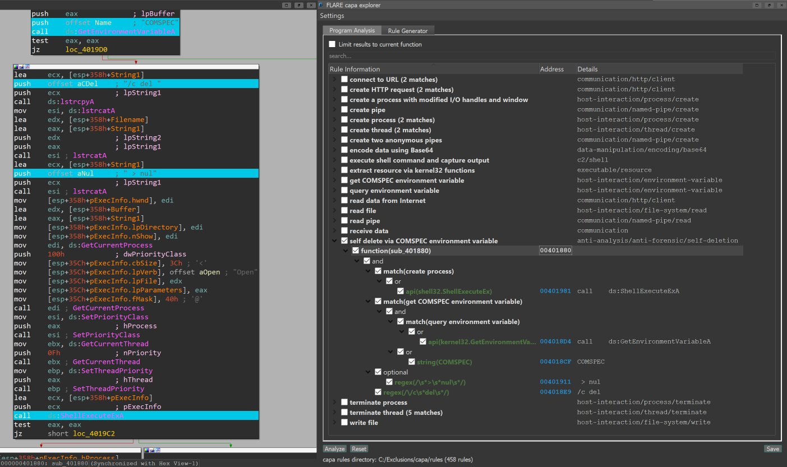

capa explorer is an IDAPython plugin that integrates the FLARE team's open-source framework, capa, with IDA Pro. capa is a framework that uses a well-defined collection of rules to 
identify capabilities in a program. You can run capa against a PE file or shellcode and it tells you what it thinks the program can do. For example, it might suggest that 
the program is a backdoor, can install services, or relies on HTTP to communicate. capa explorer runs capa directly against your IDA Pro database (IDB) without requiring access
to the original binary file. Once a database has been analyzed, capa explorer helps you identify interesting areas of a program and build new capa rules using features extracted from your IDB.

We love using capa explorer during malware analysis because it teaches us what parts of a program suggest a behavior. As we click on rows, capa explorer jumps directly 
to important addresses in the IDB and highlights key features in the Disassembly view so they stand out visually. To illustrate, we use capa explorer to 
analyze Lab 14-02 from [Practical Malware Analysis](https://nostarch.com/malware) (PMA) available [here](https://practicalmalwareanalysis.com/labs/). Our goal is to understand 
the program's functionality.

After loading Lab 14-02 into IDA and analyzing the database with capa explorer, we see that capa detected a rule match for `self delete via COMSPEC environment variable`:



We can use capa explorer to navigate our Disassembly view directly to the suspect function and get an assembly-level breakdown of why capa matched `self delete via COMSPEC environment variable`.



Using the `Rule Information` and `Details` columns capa explorer shows us that the suspect function matched `self delete via COMSPEC environment variable` because it contains capa rule matches for `create process`, `get COMSPEC environment variable`,
and `query environment variable`, references to the strings `COMSPEC`, ` > nul`, and `/c del `, and calls to the Windows API functions `GetEnvironmentVariableA` and `ShellExecuteEx`.

capa explorer also helps you build new capa rules. To start select the `Rule Generator` tab, navigate to a function in your Disassembly view,
and click `Analyze`. capa explorer will extract features from the function and display them in the `Features` pane. You can add features listed in this pane to the `Editor` pane
by either double-clicking a feature or using multi-select + right-click to add multiple features at once. The `Preview` and `Editor` panes help edit your rule. Use the `Preview` pane
to modify the rule text directly and the `Editor` pane to construct and rearrange your hierarchy of statements and features. When you finish a rule you can save it directly to a file by clicking `Save`.


For more information on the FLARE team's open-source framework, capa, check out the overview in our first [blog](https://www.fireeye.com/blog/threat-research/2020/07/capa-automatically-identify-malware-capabilities.html).

## Getting Started

### Requirements

capa explorer supports Python versions >= 3.7.x and the following IDA Pro versions:

* IDA 7.4
* IDA 7.5
* IDA 7.6 (caveat below)
* IDA 7.7

capa explorer is however limited to the Python versions supported by your IDA installation (which may not include all Python versions >= 3.7.x). Based on our testing the following matrix shows the Python versions supported
by each supported IDA version:

| | IDA 7.4 | IDA 7.5 | IDA 7.6 |
| --- | --- | --- | --- |
| Python 3.7.x | Yes | Yes | Yes |
| Python 3.8.x | Partial (see below) | Yes | Yes |
| Python 3.9.x | No | Partial (see below) | Yes |

To use capa explorer with IDA 7.4 and Python 3.8.x you must follow the instructions provided by hex-rays [here](https://hex-rays.com/blog/ida-7-4-and-python-3-8/).

To use capa explorer with IDA 7.5 and Python 3.9.x you must follow the instructions provided by hex-rays [here](https://hex-rays.com/blog/python-3-9-support-for-ida-7-5/).

If you encounter issues with your specific setup, please open a new [Issue](https://github.com/mandiant/capa/issues).

#### IDA 7.6 caveat: IDA 7.6sp1 or patch required

As described [here](https://www.hex-rays.com/blog/ida-7-6-empty-qtreeview-qtreewidget/):

> A rather nasty issue evaded our testing and found its way into IDA 7.6: using the PyQt5 modules that are shipped with IDA, QTreeView (or QTreeWidget) instances will always fail to display contents.

Therefore, in order to use capa under IDA 7.6 you need the [Service Pack 1 for IDA 7.6](https://www.hex-rays.com/products/ida/news/7_6sp1). Alternatively, you can download and install the fix corresponding to your IDA installation, replacing the original QtWidgets DLL with the one contained in the .zip file (links to Hex-Rays):


  - Windows: [pyqt5_qtwidgets_win](https://www.hex-rays.com/wp-content/uploads/2021/04/pyqt5_qtwidgets_win.zip)
  - Linux: [pyqt5_qtwidgets_linux](https://www.hex-rays.com/wp-content/uploads/2021/04/pyqt5_qtwidgets_linux.zip)
  - MacOS (Intel): [pyqt5_qtwidgets_mac_x64](https://www.hex-rays.com/wp-content/uploads/2021/04/pyqt5_qtwidgets_mac_x64.zip)
  - MacOS (AppleSilicon): [pyqt5_qtwidgets_mac_arm](https://www.hex-rays.com/wp-content/uploads/2021/04/pyqt5_qtwidgets_mac_arm.zip)


### Supported File Types

capa explorer is limited to the file types supported by capa, which include:

* Windows x86 (32- and 64-bit) PE and ELF files
* Windows x86 (32- and 64-bit) shellcode

### Installation

You can install capa explorer using the following steps:

1. Install capa and its dependencies from PyPI for the Python interpreter used by your IDA installation:
    ```
    $ pip install flare-capa
    ```
3. Download the [standard collection of capa rules](https://github.com/mandiant/capa-rules) (capa explorer needs capa rules to analyze a database)
4. Copy [capa_explorer.py](https://raw.githubusercontent.com/mandiant/capa/master/capa/ida/plugin/capa_explorer.py) to your IDA plugins directory

### Usage

1. Open IDA and analyze a supported file type (select the `Manual Load` and `Load Resources` options in IDA for best results)
2. Open capa explorer in IDA by navigating to `Edit > Plugins > FLARE capa explorer` or using the keyboard shortcut `Alt+F5`
   You can also use `ida_loader.load_and_run_plugin("capa_explorer", arg)`. `arg` is a bitflag for which setting the LSB enables automatic analysis. See `capa.ida.plugin.form.Options` for more details.
3. Select the `Program Analysis` tab
4. Click the `Analyze` button

When running capa explorer for the first time you are prompted to select a file directory containing capa rules. The plugin conveniently
remembers your selection for future runs; you can change this selection and other default settings by clicking `Settings`. We recommend 
downloading and using the [standard collection of capa rules](https://github.com/mandiant/capa-rules) when getting started with the plugin.

#### Tips for Program Analysis

* Start analysis by clicking the `Analyze` button
* Reset the plugin user interface and remove highlighting from your Disassembly view by clicking the `Reset` button
* Change your capa rules directory and other default settings by clicking `Settings`
* Hover your cursor over a rule match to view the source content of the rule
* Double-click the `Address` column to navigate your Disassembly view to the address of the associated feature
* Double-click a result in the `Rule Information` column to expand its children
* Select a checkbox in the `Rule Information` column to highlight the address of the associated feature in your Dissasembly view

#### Tips for Rule Generator

* Navigate to a function in your Disassembly view and click`Analyze` to get started
* Double-click or use multi-select + right-click to add features from the `Features` pane to the `Editor` pane
* Right-click features in the `Editor` pane to make context-specific modifications
* Drag-and-drop (single click + multi-select support) features in the `Editor` pane to construct your hierarchy of statements and features
* Right-click anywhere in the `Editor` pane not on a feature to remove all features
* Add descriptions or comments to a feature by editing the corresponding column in the `Editor` pane
* Directly edit rule text and metadata fields using the `Preview` pane
* Change the default rule author and default rule scope displayed in the `Preview` pane by clicking `Settings`

## Development

capa explorer is packaged with capa so you will need to install capa locally for development. You can install capa locally by following the steps outlined in `Method 3: Inspecting the capa source code` of the [capa 
installation guide](https://github.com/mandiant/capa/blob/master/doc/installation.md#method-3-inspecting-the-capa-source-code). Once installed, copy [capa_explorer.py](https://raw.githubusercontent.com/mandiant/capa/master/capa/ida/plugin/capa_explorer.py) 
to your plugins directory to install capa explorer in IDA.

### Components

capa explorer consists of two main components:

* An [feature extractor](https://github.com/mandiant/capa/tree/master/capa/features/extractors/ida) built on top of IDA's binary analysis engine
  * This component uses IDAPython to extract [capa features](https://github.com/mandiant/capa-rules/blob/master/doc/format.md#extracted-features) from your IDBs such as strings, 
disassembly, and control flow; these extracted features are used by capa to find feature combinations that result in a rule match
* An [interactive user interface](https://github.com/mandiant/capa/tree/master/capa/ida/plugin) for displaying and exploring capa rule matches
  * This component integrates the feature extractor and capa, providing an interactive user interface to dissect rule matches found by capa using features extracted directly from your IDBs
