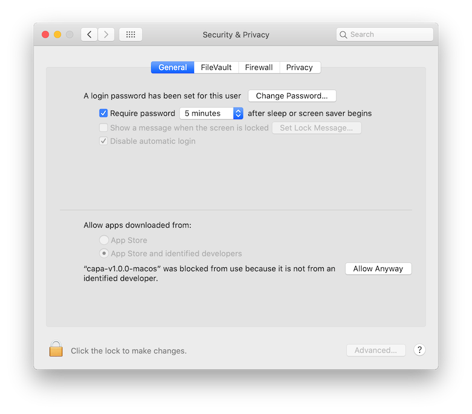

# Installation
You can install capa in a few different ways. First, if you simply want to use capa, just download the [standalone binary](https://github.com/mandiant/capa/releases). If you want to use capa as a Python library, you can install the package directly from GitHub using `pip`. If you'd like to contribute patches or features to capa, you can work with a local copy of the source code.

## Method 1: Standalone installation
If you simply want to use capa, use the standalone binaries we host on GitHub: https://github.com/mandiant/capa/releases. These binary executable files contain all the source code, Python interpreter, and associated resources needed to make capa run. This means you can run it without any installation! Just invoke the file using your terminal shell to see the help documentation.

We use PyInstaller to create these packages.

### Linux Standalone installation

The Linux Standalone binary has been built using GLIB 2.26.
Consequently, it works when using GLIB >= 2.26.
This requirement is satisfied by default in newer distribution such as Ubuntu >= 18, Debian >= 10, openSUSE >= 15.1 and CentOS >= 8.
But the binary may not work in older distributions.

### MacOS Standalone installation

By default, on MacOS Catalina or greater, Gatekeeper will block execution of the standalone binary. To resolve this, simply try to execute it once on the command-line and then go to `System Preferences` / `Security & Privacy` / `General` and approve the application:



## Method 2: Using capa as a Python library
To install capa as a Python library use `pip` to fetch the `flare-capa` module.

### 1. Install capa module
Use `pip` to install the capa module to your local Python environment. This fetches the library code to your computer but does not keep editable source files around for you to hack on. If you'd like to edit the source files, see below. `$ pip install flare-capa`

#### *Note on capa rules and library identification signatures*
This method is appropriate for integrating capa in an existing project.
This technique doesn't pull the default rule set. You can obtain rule releases from [capa-rules](https://github.com/mandiant/capa-rules/releases) and pass the directory to the entrypoint using `-r`. In the IDA Pro plugin you need to configure the rules directory path once.

```console
$ wget https://github.com/mandiant/capa-rules/archive/refs/tags/v4.0.0.zip
$ unzip v4.0.0.zip
$ capa -r /path/to/capa-rules suspicious.exe
```

This technique also doesn't set up the default library identification [signatures](https://github.com/mandiant/capa/tree/master/sigs). You can pass the signature directory using the `-s` argument.
For example, to run capa with both a rule path and a signature path:
```console
$ capa -s /path/to/capa-sigs suspicious.exe
```

Alternatively, see Method 3 below.

### 2. Use capa
You can now import the `capa` module from a Python script or use the IDA Pro plugins from the `capa/ida` directory. For more information please see the [usage](usage.md) documentation.

## Method 3: Inspecting the capa source code
If you'd like to review and modify the capa source code, you'll need to check it out from GitHub and install it locally. By following these instructions, you'll maintain a local directory of source code that you can modify and run easily. 

### 1. Check out source code
Clone the capa git repository.
We use submodules to separate [code](https://github.com/mandiant/capa), [rules](https://github.com/mandiant/capa-rules), and [test data](https://github.com/mandiant/capa-testfiles).

To clone everything use the `--recurse-submodules` option:
- CAUTION: The capa testfiles repository contains many malware samples. If you pull down everything using this method, you may want to install to a directory that is ignored by your anti-virus software.
- `$ git clone --recurse-submodules https://github.com/mandiant/capa.git /local/path/to/src` (HTTPS)
- `$ git clone --recurse-submodules git@github.com:mandiant/capa.git /local/path/to/src` (SSH)

To only get the source code and our provided rules (a more common use-case), follow these steps:
- clone repository
  - `$ git clone https://github.com/mandiant/capa.git /local/path/to/src` (HTTPS)
  - `$ git clone git@github.com:mandiant/capa.git /local/path/to/src` (SSH)
- `$ cd /local/path/to/src`
- initialize the rules submodule and pull rules
- `$ git submodule update --init rules`

### 2. Install the local source code
Use `pip` to install the source code in "editable" mode. This means that Python will load the capa module from the local directory rather than copying it to `site-packages` or `dist-packages`. This is good because it is easy to modify files and see the effects reflected immediately. But, be careful not to remove this directory unless uninstalling capa.

`$ pip install -e /local/path/to/src`

You'll find that the `capa.exe` (Windows) or `capa` (Linux/MacOS) executables in your path now invoke the capa binary from this directory.

#### Development

##### venv [optional]

For development, we recommend to use [venv](https://docs.python.org/3/tutorial/venv.html). It allows you to create a virtual environment: a self-contained directory tree that contains a Python installation for a particular version of Python, plus a number of additional packages. This approach avoids conflicts between the requirements of different applications on your computer. It also ensures that you don't overlook to add a new requirement to `setup.up` using a library already installed on your system.

To create an environment (in the parent directory, to avoid committing it by accident or messing with the linters), run: `$ python3 -m venv ../capa-env`

To activate `capa-env` in Linux or MacOS, run:
`$ source ../capa-env/bin/activate`

To activate `capa-env` in Windows, run:
`$ ..\capa-env\Scripts\activate.bat`

For more details about creating and using virtual environments, check out the [venv documentation](https://docs.python.org/3/tutorial/venv.html).

##### Install development dependencies

We use the following tools to ensure consistent code style and formatting:
  - [black](https://github.com/psf/black) code formatter
  - [isort 5](https://pypi.org/project/isort/) code formatter
  - [dos2unix](https://linux.die.net/man/1/dos2unix) for UNIX-style LF newlines
  - [capafmt](https://github.com/mandiant/capa/blob/master/scripts/capafmt.py) rule formatter

To install these development dependencies, run:

`$ pip install -e /local/path/to/src[dev]`

To check the code style, formatting and run the tests you can run the script `scripts/ci.sh`.
You can run it with the argument `no_tests` to skip the tests and only run the code style and formatting: `scripts/ci.sh no_tests`

##### Setup hooks [optional]

If you plan to contribute to capa, you may want to setup the provided hooks.
Run `scripts/setup-hooks.sh` to set the following hooks up:
- The `pre-commit` hook runs checks before every `git commit`.
  It runs `scripts/ci.sh no_tests` aborting the commit if there are code style or rule linter offenses you need to fix.
- The `pre-push` hook runs checks before every `git push`.
  It runs `scripts/ci.sh` aborting the push if there are code style or rule linter offenses or if the tests fail.
  This way you can ensure everything is alright before sending a pull request.

You can skip the checks by using the `-n`/`--no-verify` git option.

### 3. Compile binary using PyInstaller
We compile capa standalone binaries using PyInstaller. To reproduce the build process check out the source code as described above and follow the following steps.

#### Install PyInstaller:
`$ pip install pyinstaller`

Or install capa with build dependencies:

`$ pip install -e /local/path/to/src[build]`

#### Run Pyinstaller
`$ pyinstaller .github/pyinstaller/pyinstaller.spec`

You can find the compiled binary in the created directory `dist/`.
