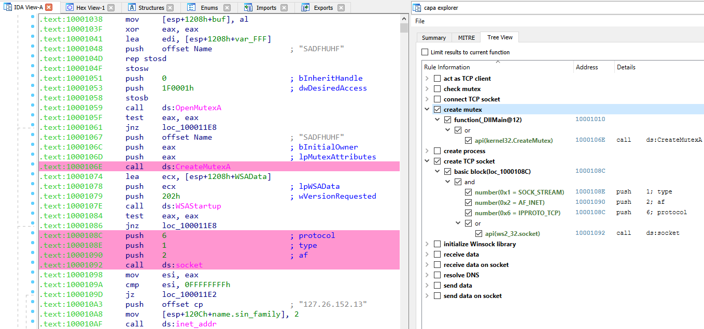

# capa usage

See `capa -h` for all supported arguments and usage examples.

## tips and tricks

  - [match only rules by given author or namespace](#only-run-selected-rules)
  - [IDA Pro capa explorer](#capa-explorer)
  - [IDA Pro rule generator](#rule-generator)

### only run selected rules
Use the `-t` option to run rules with the given metadata value (see the rule fields `rule.meta.*`).
For example, `capa -t william.ballenthin@mandiant.com` runs rules that reference Willi's email address (probably as the author), or
`capa -t communication` runs rules with the namespace `communication`.

### IDA Pro integrations
You can run capa from within IDA Pro. Run `capa/main.py` via `File - Script file...` (or ALT + F7). 
When running in IDA, capa uses IDA's disassembly and file analysis as its backend. 
These results may vary from the standalone version that uses vivisect.
IDA's analysis is generally a bit faster and more thorough than vivisect's, so you might prefer this mode.

When run under IDA, capa supports both Python 2 and Python 3 interpreters.
If you encounter issues with your specific setup, please open a new [Issue](https://github.com/fireeye/capa/issues).

Additionally, capa comes with two IDA Pro plugins located in the `capa/ida` directory: the explorer and the rule generator.

#### capa explorer
The capa explorer allows you to interactively display and browse capabilities capa identified in a binary.
As you select rules or logic, capa will highlight the addresses that support its analysis conclusions.
We like to use capa to help find the most interesting parts of a program, such as where the C2 mechanism might be.

#### rule generator
The rule generator helps you to easily write new rules based on the function you are currently analyzing in your IDA disassembly view.
It shows the features that capa can extract from the function, and lets you quickly pull these into a rule template.
You'll still have to provide the logic structures (`and`, `or`, `not`, etc.) but the features will be prepared for you.
