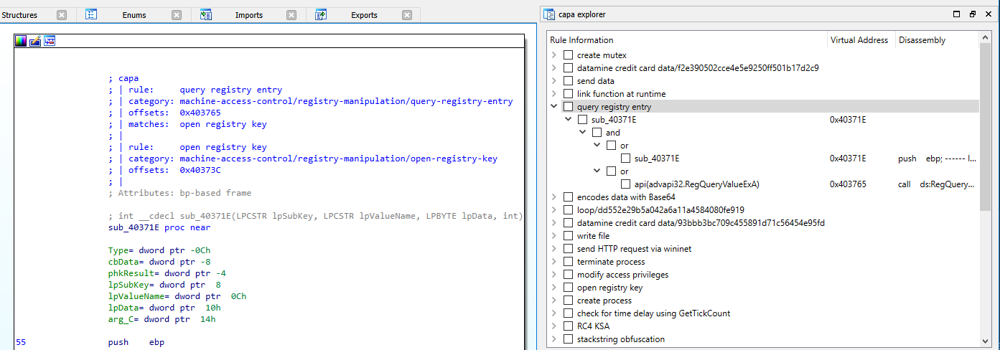

# capa usage


# command line
After you have downloaded the standalone version of capa or installed it via `pip` (see the [installation](installation.md) documentation) you can run capa directly from your terminal shell.

- `$ capa -h`
- `$ capa malware.exe`

In this mode capa relies on vivisect which only runs under Python 2.

## only run selected rules
Use the `-t` option to only run selected rules. This is the preferred method over specifying a rule path which fails if dependent rules reside in other directories.

```
$ capa -t communication malware.exe
```

# IDA Pro
capa runs from within IDA Pro. Run `capa/main.py` via File - Script file... (ALT + F7).

When running in IDA, capa uses IDA's disassembly and file analysis as its backend. These results may vary from the standalone version that uses vivisect.

In IDA, capa supports Python 2 and Python 3. If you encounter issues with your specific setup, please open a new [Issue](https://github.com/fireeye/capa/issues). 

## IDA Pro plugins
capa comes with two IDA Pro plugins located in the `capa/ida` directory.

### capa explorer
The capa explorer allows you to interactively display and browse capabilities capa identified in a binary.



### rule generator
The rule generator helps you to easily write new rules based on the function you are currently analyzing in your IDA disassembly view.
